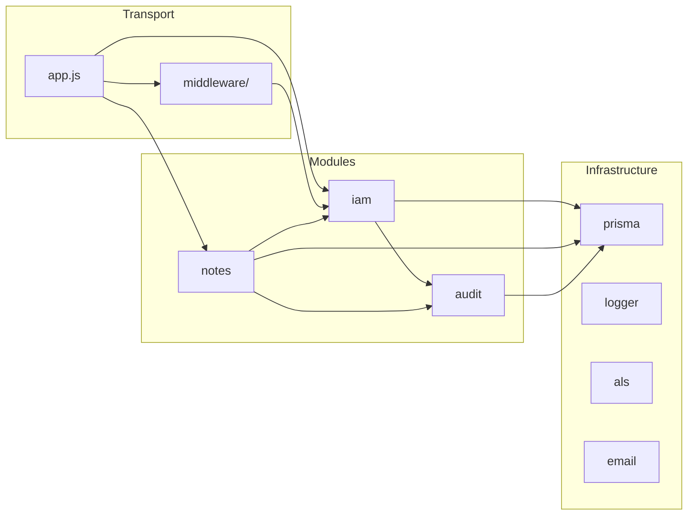
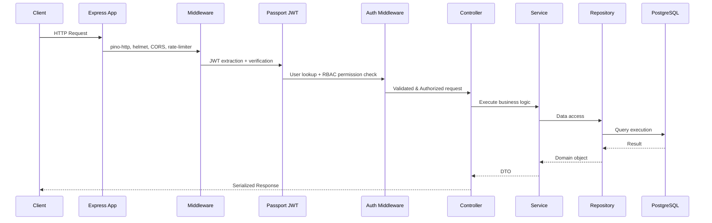

# Architecture Overview

## System Architecture

**Type**: Modular Monolith  
**Runtime**: Node.js ≥18.18.0 (ESM)  
**Framework**: Express 4.x  
**Database**: PostgreSQL 16 via Prisma 6.x  
**Auth**: JWT (Passport.js) with database-driven RBAC

The system follows a Modular Monolith architectural pattern. This ensures that the codebase remains simple and easy to deploy as a single unit, while strictly enforcing boundaries between distinct business domains (IAM, Notes, Audit) to prevent tightly-coupled "spaghetti" code.

## Layer Architecture

The project structure strictly separates transport, infrastructure, and business logic:

- `src/app.js` and `src/index.js`: Composition root, express setup, and application lifecycle.
- `src/infrastructure/`: Shared technical capabilities that are decoupled from business logic (Prisma, Logging, Email).
- `src/middleware/`: Global Express middleware representing cross-cutting transport concerns.
- `src/modules/`: Self-contained business domains.
- `src/shared/`: Stateless utilities and reusable generic helpers.

## Module Boundaries

The modules (`iam`, `notes`, `audit`) operate independently. Cross-module communication happens strictly through exported services and explicit public APIs defined in each module's `index.js` (Barrel pattern).

### Inter-Module Communication

Modules communicate via a Composition Root pattern. `src/modules/router.js` acts as the registration point for routes and cross-module hooks. For example, when a user is deleted in `iam`, it triggers a callback to delete associated notes in `notes`. `iam` has no compile-time dependency on `notes`.

## Database Architecture

- **Provider**: PostgreSQL
- **ORM**: Prisma Client
- **Design**: Strict foreign key constraints and junction tables for many-to-many relationships (e.g., `UserRole`, `RolePermission`).
- **Telemetry**: Prisma queries are monitored, and slow queries are logged automatically.

## Authentication Architecture

Authentication relies on a dual-token JWT model:

1. **Access Token**: Short-lived, stateless, verified via cryptographic signature.
2. **Refresh Token**: Long-lived, hashed (SHA-256) and stored in the database. Grouped by `familyId`.

- **Token Rotation & Security**: On refresh, the old token is blacklisted. If a blacklisted token is reused, the entire token family is revoked immediately to prevent session hijacking.

## Authorization Architecture

Authorization is handled via a dynamic, database-driven Role-Based Access Control (RBAC) system.

- **Permissions**: Follow the format `action:resource:scope` (e.g., `update:notes:own`).
- **Resolution**: Route-level middleware (`auth.middleware.js`) asserts that the required permissions are held by the actor. Scope verification (`:own` vs `:any`) is deferred to the service layer.
- **Escalation Prevention**: The system enforces that no user can assign a role with a higher privilege level than their own maximum level.

## Request Lifecycle

