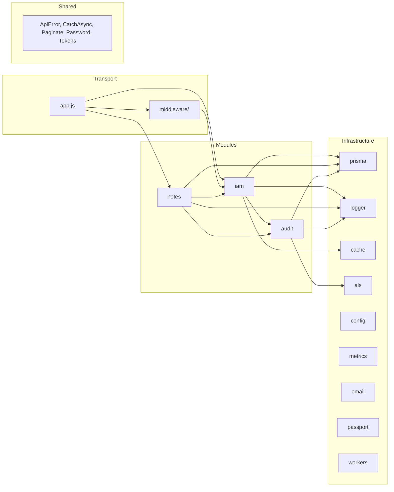
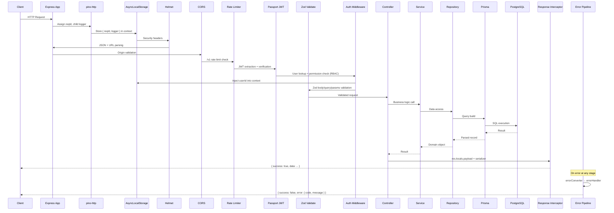

# Architecture

High-level architecture documentation for the Notes API backend. Implementation-aware and continuously maintained.

---

## System Overview

**Type**: Modular Monolith  
**Runtime**: Node.js ≥18.18.0 (ESM)  
**Framework**: Express 4.x  
**Database**: PostgreSQL 16 via Prisma 6.x  
**Cache**: In-memory LRU (lru-cache)  
**Auth**: JWT (Passport.js) with database-driven RBAC

---

## Module Boundary Map



### Dependency Direction (Enforced by ESLint boundaries plugin)

| Module           | Can Import From                                     |
| ---------------- | --------------------------------------------------- |
| `shared`         | `shared`, `infrastructure`                          |
| `iam`            | `shared`, `iam`, `infrastructure`                   |
| `notes`          | `shared`, `iam`, `notes`, `audit`, `infrastructure` |
| `audit`          | `shared`, `audit`, `infrastructure`                 |
| `infrastructure` | `shared`, `infrastructure`, `iam`                   |
| `app` (root)     | `shared`, `iam`, `notes`, `infrastructure`, `docs`  |

---

## Directory Structure

```
src/
├── app.js                          # Express app, middleware stack, health probes
├── index.js                        # Bootstrap, lifecycle, shutdown, telemetry
├── infrastructure/
│   ├── als.js                      # AsyncLocalStorage instance
│   ├── cache.js                    # LRU-cache wrapper (in-memory)
│   ├── config.js                   # Zod-validated env config
│   ├── logger.js                   # Pino logger with ALS proxy
│   ├── email/                      # Email infrastructure capability
│   │   ├── index.js                # Barrel exposing emailService
│   │   ├── mailer.js               # Nodemailer transporter and SMTP connection verification
│   │   ├── email.service.js        # Domain-agnostic send capabilities with HTML templates
│   │   └── templates/              # Plain JS functions returning HTML strings
│   ├── metrics.js                  # In-process counters + periodic flush
│   ├── passport.js                 # JWT strategy
│   ├── prisma.js                   # Prisma singleton proxy + slow query telemetry
│   └── workers/
│       └── token-cleanup.worker.js # Cron: expired token purge with advisory locks
├── middleware/
│   ├── auth.middleware.js          # JWT auth + RBAC permission gate
│   ├── error.middleware.js         # Error converter + handler
│   ├── pino-http.middleware.js     # Structured request logging
│   ├── rate-limiter.middleware.js  # Three-tier rate limiting
│   ├── response-interceptor.middleware.js  # Canonical response envelope
│   └── validate.middleware.js      # Zod schema validation
├── modules/
│   ├── router.js                   # Composition root, module registration
│   ├── iam/                        # Auth, users, RBAC, tokens (sub-folders)
│   ├── notes/                      # Notes CRUD (flat structure)
│   └── audit/                      # Event audit logging (flat structure)
└── shared/                         # Stateless utilities only
```

---

## Request Lifecycle



---

## Authentication Flow

### Login → Token Issuance

1. Client sends `POST /v1/auth/login` with `{ email, password }`.
2. `auth.service.loginUserWithEmailAndPassword` verifies credentials via bcrypt.
3. On success, `token.service.generateAuthTokens` creates:
   - **Access token** — JWT with short TTL (default 30 min), stateless.
   - **Refresh token** — JWT with long TTL (default 30 days), hashed (SHA-256) and stored in DB with `familyId`.
4. Audit event `auth.login` persisted.
5. Both tokens returned to client.

### Token Refresh — Rotation with Reuse Detection

1. Client sends `POST /v1/auth/refresh-tokens` with `{ refreshToken }`.
2. Token is verified (JWT signature + DB lookup by hash).
3. If token is **not blacklisted**: old token blacklisted, new pair generated within same `familyId`.
4. If token **is blacklisted** (reuse detected):
   - 2-second grace period for concurrent race conditions.
   - Beyond grace: **entire token family revoked** (all refresh tokens in family deleted).
   - Audit event `auth.refresh.reuse_detected` logged.
   - Session terminated — user must re-login.

### Access Control

- JWT extracted by Passport middleware.
- `auth.middleware.js` performs RBAC check: resolves user permissions from DB/cache, checks against required permissions (AND logic).
- Ownership-aware authorization deferred to service layer via `assertScopedPermission`.

---

## RBAC Architecture

### Permission Model

Permissions follow `action:resource:scope` convention:

- **action**: `read`, `update`, `delete`, `create`, `assign`
- **resource**: `users`, `notes`, `roles`
- **scope**: `own` (owner-only), `any` (cross-resource)

### Scope Escalation

- `:any` implicitly covers `:own` — having `update:notes:any` satisfies `update:notes:own`.
- Wildcard `*:*:*` grants super admin access.

### Escalation Prevention

- Actors cannot assign roles with a `level` higher than their own maximum role level.
- Violation is logged as `authz.escalation.attempted` in both operational logs and audit trail.

### Permission Resolution

```
User → UserRole (many-to-many) → Role → RolePermission (many-to-many) → Permission
```

- Resolved via single Prisma query with nested includes.
- Cached in LRU for 5 minutes per user, keyed with global version counter.
- Cache invalidation: per-user on role assignment, global version bump for schema evolution.

---

## Audit Logging

- Decoupled `AuditLog` table — no foreign keys to business entities.
- Survives entity deletion (intentional architectural decision).
- Event taxonomy: `{domain}.{action}` (e.g., `auth.login`, `notes.created`, `authz.escalation.attempted`).
- Metadata sanitized before persistence (depth limit, array limit, string truncation, forbidden key redaction).
- Integrates with ALS for automatic `actorId` and `reqId` injection.
- Participates in transactions for atomicity with business operations.

---

## Background Workers

### Token Cleanup (`token-cleanup.worker.js`)

- Runs on configurable cron schedule.
- Uses PostgreSQL advisory locks for distributed safety.
- Deletes expired and blacklisted tokens older than threshold.
- Controlled by `ENABLE_BACKGROUND_WORKERS` env var — can be disabled per node.
- Registered in `global.activeWorkers` for graceful shutdown await.

---

## Email Infrastructure

The project uses a dedicated Email Infrastructure subsystem located at `src/infrastructure/email`.

- **Domain-Driven Design Strictness**: Email is treated as a technical delivery mechanism (I/O side effect), completely decoupled from business domains.
- **Layered Flow**:
  - **Controllers** orchestrate HTTP and never interact with the email system directly.
  - **Domain Services** (e.g., `iam/services/auth.service.js`) generate required tokens and orchestrate the dispatch by calling the `emailService`.
  - **Infrastructure** (`infrastructure/email/email.service.js`) handles template rendering, error swallowing (to prevent application crashes on SMTP failure), and Pino logging without throwing HTTP-specific errors (`ApiError`).
- **Transporter Isolation**: Raw SMTP socket logic and `verifySmtpConnection()` are kept inside `mailer.js`, separated from template generation.
- **Fail Fast Configuration**: SMTP credentials are required in `config.js` and connection is asserted via `verifySmtpConnection()` at application bootstrap.

---

## Health Probes

| Endpoint      | Purpose               | Checks                                        |
| ------------- | --------------------- | --------------------------------------------- |
| `GET /live`   | Process vitality      | Always UP unless shutting down                |
| `GET /ready`  | Dependency readiness  | PostgreSQL `SELECT 1` with 5s timeout         |
| `GET /health` | Operational dashboard | DB status, uptime, environment, worker status |

---

## Graceful Shutdown

Multi-phase reverse-order teardown on `SIGTERM`/`SIGINT`:

1. Stop HTTP server (no new connections).
2. Stop cron scheduling.
3. Await active workers (5s timeout).
4. Disconnect Prisma client (3s timeout).
5. Force exit after 10s global fallback.

---

## Database Interaction Patterns

- **Repository pattern** — all Prisma operations abstracted.
- **Transaction support** — `runInTransaction(callback)` wraps `prisma.$transaction()`.
- **Prisma proxy** — dynamic singleton that supports Testcontainers reconnection via `$reconnect()`.
- **Slow query telemetry** — queries exceeding configurable threshold logged as warnings.
- **Global password omit** — `password` field excluded from all User queries by default (Prisma `omit` config).
- **Offset pagination** for users (`Paginate.js`).
- **Cursor pagination** for notes (`PaginateCursor.js`).

---

## Inter-Module Communication

### Composition Root Pattern

`src/modules/router.js` serves as the composition root:

1. Registers IAM module routes with optional auth rate limiter.
2. Registers Notes module routes.
3. Wires inter-module hooks: `userService.registerUserDeletionHook` → `deleteManyByOwnerId`.

### Dependency Inversion for Cascading

User deletion triggers note cleanup via hook pattern:

```
IAM (user.service.js) → calls registered hooks → Notes (deleteManyByOwnerId)
```

IAM has zero compile-time knowledge of Notes. The hook is wired at the composition root.

---

## Changelog

### 2026-06-09

- Initial creation from full codebase analysis
- Documented module boundaries, request lifecycle, auth flow, RBAC, audit logging, shutdown, health probes
- Added Mermaid diagrams for dependency map and request lifecycle
