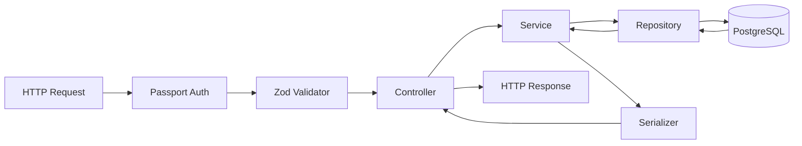

# API Architecture Wiki

## RESTful Design

The API follows strict resource-oriented design principles under the `/v1` namespace.

## Component Responsibilities

### 1. Routers (`*.route.js`)

- Transport-layer orchestrators.
- Wire together Auth middleware, Validation middleware (Zod schemas), and the Controller handler.
- Aggregate up to the Composition Root (`src/modules/router.js`).

### 2. Validation Pipeline (`validate.middleware.js` & Zod)

- **Engine**: Zod (`zod`).
- **Execution**: Runs _before_ the controller. Strips unknown fields, coerces types, and provides runtime type guarantees for the rest of the application.
- **DTOs**: Zod schemas serve as the Data Transfer Object contracts.

### 3. Controllers (`*.controller.js`)

- **Responsibility**: Exclusively handle the HTTP Request/Response lifecycle.
- **Limitations**: Controllers do NOT contain business logic. They extract data from `req`, pass it to the Service layer, and return the result using standard HTTP status codes.
- **Error Handling**: Wrapped in `catchAsync` to forward rejected promises seamlessly to the global error middleware without explicit try/catch blocks.

### 4. Services (`*.service.js`)

- **Responsibility**: Pure business logic and domain orchestration.
- **Characteristics**: Agnostic to the transport layer (Express). They do not know what `req` or `res` are. This makes them highly testable and reusable.

### 5. Repositories (`*.repository.js`)

- **Responsibility**: Database access abstraction.
- **Characteristics**: Wrap Prisma calls. This prevents the Service layer from being tightly coupled to Prisma's specific API syntax, facilitating easier testing and future database migrations.

### 6. Serializers (`*.serializer.js`)

- Ensure sensitive data (like passwords) are stripped before sending the payload back to the client. This is often reinforced globally by the `response-interceptor.middleware.js`.

## Data Flow Diagram

