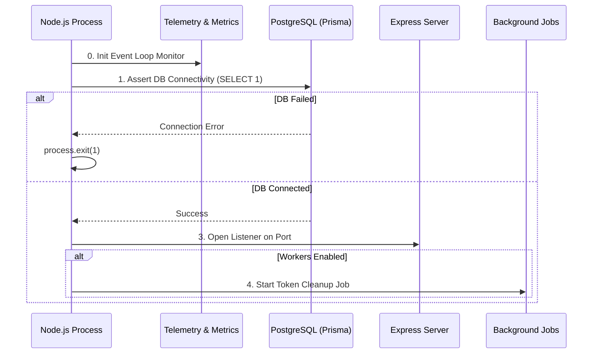
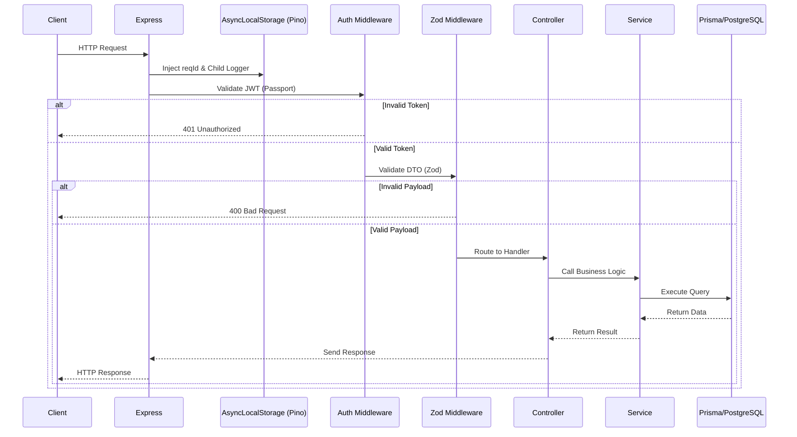

# Runtime Lifecycle Documentation

## Process Bootstrap Lifecycle

When `npm start` (or `node src/index.js`) is executed, the runtime follows a strict sequence:

## Request Lifecycle (End-to-End)

Every incoming HTTP request flows through a predictable middleware pipeline.

## Graceful Shutdown Lifecycle

Triggered by `SIGINT` or `SIGTERM`:

1. **Set Flag**: `global.isShuttingDown = true` (Fails new `/ready` and `/health` probes).
2. **Stop Server**: `server.close()` stops accepting new HTTP connections.
3. **Stop Cron**: Background jobs are halted.
4. **Await Workers**: Waits for active in-flight jobs to drain (max 5s timeout).
5. **Disconnect Prisma**: `prisma.$disconnect()` is called to flush DB connections safely.
6. **Exit**: Process exits cleanly.
   _(Note: A 10-second hard-kill timeout acts as a failsafe)._
