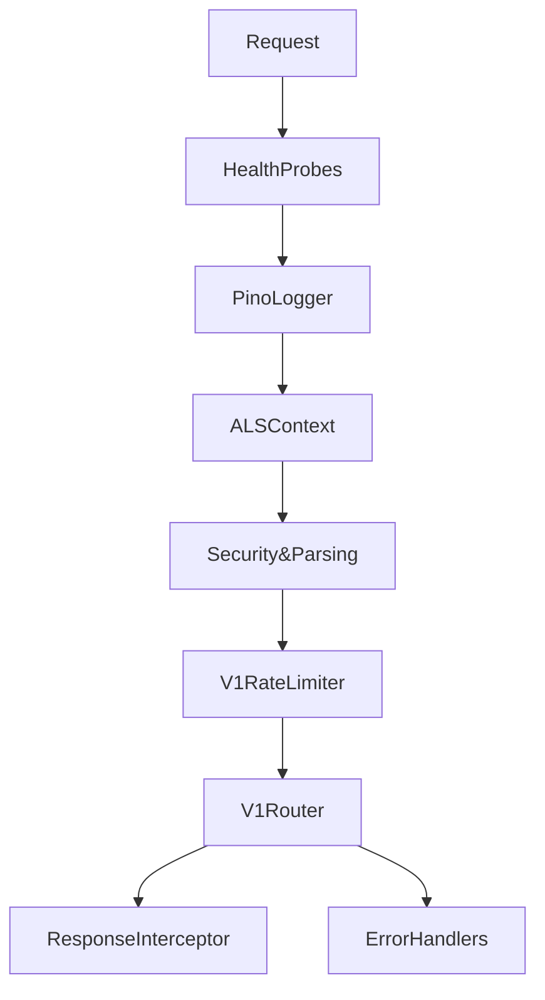

# File Documentation

File:
`src/app.js`

Domain:
Infrastructure / Application Bootstrapping

Layer:
Transport / Transport Layer Initialization

Runtime Role:
HTTP Server configuration, middleware pipeline orchestration, and global request lifecycle initialization.

Dependencies:

- Express
- Helmet
- Compression
- Cors
- Passport
- Pino
- Prisma
- Various middleware components

---

# 2. PURPOSE

This file serves as the primary configuration core for the Express.js application.

It acts as the architectural backbone that wires up:

- the middleware pipeline
- the centralized v1 router
- observability (logging & correlation)
- security headers
- operational health probes

This file exists to decouple the HTTP transport configuration from the actual server bootstrapping logic (which typically lives in `index.js` or `server.js`). It ensures that the application instance can be cleanly exported for testing or deferred startup without immediately binding to a network port.

---

# 3. RUNTIME RESPONSIBILITIES

Runtime Responsibilities:

- Configures trust proxy settings for reverse proxy compatibility.
- Exposes critical operational probes (`/live`, `/ready`, `/health`) used by orchestrators (e.g., Kubernetes).
- Bootstraps the Pino HTTP structured logger.
- Injects `AsyncLocalStorage` request-scoped context (correlation ID and logger) into every request.
- Applies standard security headers using Helmet.
- Parses JSON and URL-encoded payloads.
- Configures strict CORS policies based on environment constraints.
- Mounts rate-limiting logic on the `v1` namespace.
- Initializes Passport for JWT authentication.
- Mounts the centralized `v1Router`.
- Serializes responses and catches untrapped errors to pass them through the structured error-handling pipeline.

---

# 4. IMPORT ANALYSIS

## Important Imports

### `express`

Used for:

- Initializing the HTTP server and middleware pipeline.

### `pino-http.middleware.js`

Used for:

- Injecting high-performance structured logging on all incoming requests.
  Coupling Level: HIGH (every request touches this).

### `als.js` (AsyncLocalStorage)

Used for:

- Propagating request context (logger, reqId) across asynchronous boundaries without explicit prop drilling.
  Runtime Position: Very early in the pipeline.

### `passport.js`

Used for:

- Initializing the authentication subsystem and wiring the JWT strategy.

### `router.js`

Used for:

- Aggregating all domain routes. Ensures `app.js` doesn't leak domain-specific routes.

---

# 5. EXPORT ANALYSIS

## Exported Functions

### `export { app };`

Primary orchestration entity for the HTTP transport layer.

Called by:

- `src/index.js` (Server bootstrapper)
- Integration tests (typically passed to `supertest`)

Depends on:

- The entire middleware chain and `v1Router` being properly constructed.

---

# 6. INTERNAL EXECUTION FLOW

## Execution Flow

1. Express instance created.
2. Proxy trust explicitly set for load balancer context.
3. Operational probes (`/live`, `/ready`, `/health`) mounted bypassing heavy middleware.
4. Pino structured logger injected.
5. `AsyncLocalStorage` runs, storing correlation ID and logger into context.
6. Payload parsing and security headers applied (Helmet, CORS, body parsers).
7. Rate limiting applied to `/v1`.
8. Passport authentication framework initialized.
9. Global `v1Router` mounted.
10. Global response interceptor normalizes successful responses.
11. Unmatched routes converted to 404 `ApiError`.
12. Global error handlers process and standardize error outputs.



---

# 7. IMPORTANT CODE EXAMPLES

## Context Injection Example

```js
// inject request scoped context
app.use((req, res, next) => {
  const store = {
    reqId: req.id,
    logger: req.log,
  };
  asyncLocalStorage.run(store, () => next());
});
```

**Why this matters:**
This is crucial for distributed tracing. By utilizing `AsyncLocalStorage`, deeply nested services or repositories can fetch the current request's logger or ID without having it explicitly passed down through function signatures.

## Readiness Probe Example

```js
app.get('/ready', async (req, res) => {
  if (global.isShuttingDown) {
    return res.status(httpStatus.SERVICE_UNAVAILABLE).send({ status: 'NOT_READY', error: 'Shutting down' });
  }

  const timeoutPromise = new Promise((_, reject) => {
    setTimeout(() => reject(new Error('Database readiness handshake timed out')), 5000);
  });

  try {
    await Promise.race([prisma.$queryRaw`SELECT 1`, timeoutPromise]);
    res.status(httpStatus.OK).send({ status: 'READY' });
  } catch (err) {
    res.status(httpStatus.SERVICE_UNAVAILABLE).send({ status: 'NOT_READY', error: err.message });
  }
});
```

**Why this matters:**
Provides a hard dependency check (database) with a strict SLA (5s timeout). Ensures traffic is not routed to this pod if the database is unresponsive, while preventing a hanging query from permanently stalling the health check.

---

# 8. CROSS-FILE RELATIONSHIPS

### `src/index.js`

Responsibility: Node.js process orchestration.
Relationship: Imports `app` to bind to the network port (`app.listen`).

### `src/modules/router.js`

Responsibility: Route aggregation.
Relationship: Provides the boundary between infrastructure/transport and business domains. `app.js` knows nothing about specific modules.

### `src/infrastructure/config.js`

Responsibility: Environment variable validation.
Relationship: Dictates CORS domains and environment-specific behaviors within `app.js`.

---

# 9. DATABASE INTERACTIONS

Touched Models:

- No specific models.

Transaction Boundary:

- None.

Query Patterns:

- Performs lightweight `SELECT 1` queries via `prisma.$queryRaw` within the `/ready` and `/health` probes.

Potential Risks:

- If Prisma connection pool is exhausted, probes might fail or timeout, falsely taking the pod out of rotation.

---

# 10. AUTHORIZATION & SECURITY

Security Analysis:

Authorization depends on:

- Global CORS whitelist initialized here via `config.cors.origins`.
- Passport initialization setting up strategy registries.
- Helmet establishing strict browser HTTP boundaries.

Security Boundary:
`app.js` guarantees that security headers and proxy settings are applied _before_ any business logic is executed.

---

# 11. VALIDATION FLOW

No direct DTO validation occurs here.
`app.js` is responsible for parsing raw bytes into JSON (`express.json()`) but relies on `validate.middleware.js` (used in specific routes) to enforce schemas.

---

# 12. LOGGING & OBSERVABILITY

- Injects `pinoHttp` at the very top of the pipeline, meaning every matched request will emit a structured request log.
- Bootstraps the correlation ID (`req.id`) through `ALS` for downstream logging trace coherence.

---

# 13. ARCHITECTURAL RISKS

### Order of Operations

The Express middleware chain is highly order-dependent. Injecting a parsing middleware after a route that requires it will break the application.
Specifically, placing `errorConverter` and `errorHandler` anywhere but the very bottom will result in unhandled exceptions bubbling up to Node.js.

### Global State Dependency

The probes rely on `global.isShuttingDown`. Global state mutations can be risky and create implicit coupling between the HTTP layer and the graceful shutdown logic located in `index.js`.

---

# 14. EXTENSION POINTS

- **New Global Middleware**: Must be added carefully respecting order (e.g., above routing, but below context injection).
- **New API Versions**: Can be added seamlessly by mounting a new router (e.g., `app.use('/v2', v2Router)`).
- **New Probes**: Custom metrics endpoints for Prometheus scraping would be safely mounted above the Pino middleware to reduce log noise.

---

# 15. ERP BUSINESS IMPACT

This file participates in:

- System reliability (health checks ensure load balancers don't send traffic to dead instances).
- Data integrity (strict body parsing).
- System security (CORS/Helmet ensuring browser clients are properly restricted).

---

# 16. FINAL ENGINEERING ASSESSMENT

Maintainability:
HIGH

Coupling:
LOW (Depends on abstractions, not direct domain services).

Scalability:
HIGH (Stateless configuration).

Primary Concern:
The `global.isShuttingDown` flag introduces a minor code smell but is acceptable for lightweight process orchestration.
