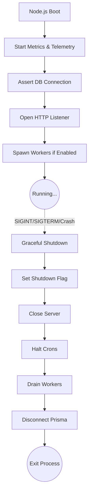

# File Documentation

File:
`src/index.js`

Domain:
Infrastructure / Application Bootstrapping

Layer:
Process Management / Server Entrypoint

Runtime Role:
Node.js process orchestration, database initialization, telemetry setup, background worker spawning, and graceful shutdown handling.

Dependencies:

- `app.js` (Express configuration)
- `config.js` (Environment settings)
- `logger.js` (Structured logging)
- `prisma.js` (Database ORM)
- `metrics.js`
- `token-cleanup.worker.js` (Background Cron)

---

# 2. PURPOSE

This is the main entrypoint of the entire Node.js backend.

Its sole purpose is to safely transition the application from a cold start to a running state, and conversely, to orchestrate a graceful shutdown when instructed by the host OS or orchestrator (like Kubernetes or Docker). It binds the pre-configured HTTP layer (`app.js`) to the network port and establishes critical infrastructure connections (like Prisma).

It deliberately avoids containing any routing or business logic.

---

# 3. RUNTIME RESPONSIBILITIES

Runtime Responsibilities:

- Boots up event loop telemetry and metrics flushers.
- Asserts a valid connection to the PostgreSQL database before accepting HTTP traffic.
- Opens the Express HTTP listener on the configured port.
- Conditionally starts background cron jobs (e.g., token cleanup) if enabled for the current node.
- Traps unhandled exceptions and unhandled promise rejections to prevent zombie processes.
- Intercepts OS signals (`SIGTERM`, `SIGINT`) to trigger graceful shutdowns.
- Orchestrates the shutdown sequence: stops HTTP traffic, halts cron jobs, drains active workers, and disconnects the database within strict timeout boundaries.

---

# 4. IMPORT ANALYSIS

## Important Imports

### `app.js`

Used for:

- The configured Express instance.
  Coupling Level: HIGH (this file is useless without `app.js`).

### `prisma.js`

Used for:

- Connecting/disconnecting the database and asserting connectivity at boot.

### `perf_hooks` (Native Node.js)

Used for:

- Deep engine-level telemetry to monitor Event Loop lag.

### `token-cleanup.worker.js`

Used for:

- Starting background maintenance tasks.

---

# 5. EXPORT ANALYSIS

This file has **NO EXPORTS**.
It is executed directly by the Node.js binary.

---

# 6. INTERNAL EXECUTION FLOW

## Execution Flow

1. Native Node.js `perf_hooks` initialized for Event Loop monitoring.
2. Background metrics flusher started.
3. Database connection asserted via a fast `SELECT 1` query.
4. HTTP listener opened (starts accepting traffic).
5. Background cron jobs initialized if `config.enableBackgroundWorkers` is true.
6. Process waits.
7. Upon receiving an OS signal (`SIGTERM`) or fatal error, graceful shutdown begins.
8. `global.isShuttingDown` is set to `true` (signaling health probes in `app.js` to return 503).
9. HTTP listener stops accepting new connections and finishes active requests.
10. Background crons are stopped.
11. Active background workers are awaited with a 5-second timeout.
12. Prisma ORM is disconnected with a 3-second timeout.
13. Node process exits with code 0 (success) or 1 (failure).



---

# 7. IMPORTANT CODE EXAMPLES

## Startup Database Assertion

```javascript
// 1. Assert PostgreSQL availability at startup before opening HTTP listener
logger.info('Asserting PostgreSQL database connectivity...');
await prisma.$queryRaw`SELECT 1`;
logger.info('Successfully connected to PostgreSQL');
```

**Why this matters:**
This enforces a "fail-fast" boot sequence. If the database is unreachable, the pod crashes immediately rather than starting the HTTP listener and serving 500 errors to users.

## Graceful Worker Draining

```javascript
// 3. Await Active Workers (max 5 seconds)
if (global.activeWorkers.size > 0) {
  logger.info(`Waiting for ${global.activeWorkers.size} active workers to complete...`);
  try {
    await Promise.race([
      Promise.all(Array.from(global.activeWorkers)),
      new Promise((_, reject) => {
        setTimeout(() => reject(new Error('Worker shutdown timeout')), 5000);
      }),
    ]);
    logger.info('All active workers completed safely');
  } catch (err) {
    logger.warn({ err }, 'Not all workers completed cleanly during shutdown');
  }
}
```

**Why this matters:**
It prevents data corruption. If a background worker is mid-transaction when a deployment occurs, this code gives it 5 seconds to finish its work before the process is aggressively killed.

---

# 8. CROSS-FILE RELATIONSHIPS

### `src/app.js`

Responsibility: Application configuration.
Relationship: `index.js` acts as the host/runner for `app.js`.

### `src/infrastructure/config.js`

Responsibility: System settings.
Relationship: Controls whether this specific node instance should boot up background workers, allowing for separation of web nodes and worker nodes in production.

---

# 9. DATABASE INTERACTIONS

Touched Models:

- None directly.

Transaction Boundary:

- None.

Query Patterns:

- `SELECT 1` during boot for liveness assertion.
- Disconnects global connection pool during shutdown.

Potential Risks:

- Disconnect logic is wrapped in a timeout to prevent an unresponsive database from holding the shutdown process hostage.

---

# 10. AUTHORIZATION & SECURITY

No direct security logic. Security is handled downstream in `app.js` and middleware.

---

# 11. VALIDATION FLOW

No DTO validation.

---

# 12. LOGGING & OBSERVABILITY

Highly observable boot sequence:

- Uses `perf_hooks` to measure Event Loop lag in nanoseconds, logging warnings if it exceeds `telemetry.eventLoopLagThresholdMs`.
- Emits detailed logs for every phase of the startup and shutdown sequence, which is critical for debugging deployment failures in Kubernetes or Docker Swarm.

---

# 13. ARCHITECTURAL RISKS

### Global State Mutations

The use of `global.isShuttingDown` and `global.activeWorkers` introduces mutable global state. While generally considered an anti-pattern in Node.js, it is acceptable here because it is strictly isolated to the orchestration boundary to facilitate cross-system shutdown signaling.

### Hardcoded Timeouts

The shutdown sequence relies on hardcoded timeouts (10s force exit, 5s worker drain, 3s Prisma disconnect). If a critical task legitimately takes 6 seconds, it will be violently terminated.

---

# 14. EXTENSION POINTS

- **New Infrastructure Dependencies**: Any new infrastructure (e.g., Redis, Kafka, RabbitMQ) MUST have its connection logic added to the `bootstrap()` function and its disconnection logic added to the `performShutdown()` sequence.
- **Microservice Splitting**: The `config.enableBackgroundWorkers` flag indicates this monolith could eventually be split. By setting it to `false`, a deployment becomes a pure API node.

---

# 15. ERP BUSINESS IMPACT

This file participates in:

- System Resilience: Ensures the ERP system boots reliably and shuts down without losing in-flight data or causing database corruption.
- Deployment Stability: Works directly with orchestrator mechanisms (Kubernetes Pod Lifecycle) to ensure zero-downtime rolling updates.

---

# 16. FINAL ENGINEERING ASSESSMENT

Maintainability:
HIGH

Coupling:
LOW (Acts as the root composer).

Scalability:
HIGH (Facilitates worker-node vs web-node deployments).

Primary Concern:
The hardcoded timeouts during shutdown might need to be shifted to `config.js` to allow different environments (e.g., heavily loaded production vs dev) to scale their grace periods.
