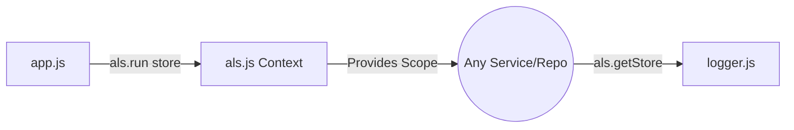

# File Documentation

File:
`src/infrastructure/als.js`

Domain:
Infrastructure / Request Context

Layer:
Process Utilities

Runtime Role:
Provides a thread-local-like storage mechanism for propagating request-scoped context across asynchronous boundaries without explicit prop drilling.

Dependencies:

- Native Node.js `async_hooks` (specifically `AsyncLocalStorage`)

---

# 2. PURPOSE

In Node.js, propagating contextual data (like correlation IDs, tenant IDs, or request loggers) deeply into repositories or services traditionally requires passing that context through every function signature.

This file solves that architectural problem by leveraging `AsyncLocalStorage`. It provides a globally accessible singleton that can store and retrieve data scoped _strictly_ to the current async execution context (the HTTP request).

---

# 3. RUNTIME RESPONSIBILITIES

Runtime Responsibilities:

- Instantiates a single, immutable instance of `AsyncLocalStorage`.
- Attaches the instance to the Node.js `global` object using a unique `Symbol` to guarantee it is never duplicated or overwritten during hot reloads or module cache invalidations.
- Exposes this singleton to the rest of the application.

---

# 4. IMPORT ANALYSIS

## Important Imports

### `AsyncLocalStorage` from `async_hooks`

Used for:

- Creating the storage context.
  Coupling Level: NATIVE (Node.js built-in API).

---

# 5. EXPORT ANALYSIS

## Exported Variables

### `export const als`

The globally shared `AsyncLocalStorage` instance.

Called by:

- `src/app.js` (to inject the initial context: logger and reqId).
- `src/infrastructure/logger.js` (to retrieve the request-scoped logger).

---

# 6. INTERNAL EXECUTION FLOW

## Execution Flow

1. On module load, a unique `Symbol` is generated.
2. The file checks if an instance already exists on the `global` object under this `Symbol`.
3. If not, it instantiates `new AsyncLocalStorage()` and assigns it.
4. It exports the stored instance.



---

# 7. IMPORTANT CODE EXAMPLES

## Global Singleton Anti-Collision

```javascript
const ALS_SYMBOL = Symbol.for('notes-backend.shared.als.singleton');

// eslint-disable-next-line security/detect-object-injection
if (!global[ALS_SYMBOL]) {
  global[ALS_SYMBOL] = new AsyncLocalStorage();
}

export const als = global[ALS_SYMBOL];
```

**Why this matters:**
In ESM or testing environments (like Jest/Vitest), module caches can sometimes be cleared or re-evaluated, which would result in multiple `AsyncLocalStorage` instances. If context is saved in one instance but retrieved from another, it results in silent `undefined` errors. Attaching it to `global` via a `Symbol.for` guarantees absolute uniqueness across the entire V8 isolate.

---

# 8. CROSS-FILE RELATIONSHIPS

### `src/app.js`

Responsibility: Pipeline entry.
Relationship: Wraps every incoming request in `als.run()`, seeding it with Pino's child logger.

### `src/infrastructure/logger.js`

Responsibility: System logging.
Relationship: Reads from `als.getStore()` to automatically append correlation IDs to every log line without the developer needing to pass the logger manually.

---

# 9. DATABASE INTERACTIONS

None.

---

# 10. AUTHORIZATION & SECURITY

Security Risk:
If sensitive data (like unhashed passwords or raw JWTs) are placed into `als`, they become globally accessible to any code executing within that request's async tree, increasing the blast radius of a potential malicious dependency or prototype pollution attack.

---

# 11. VALIDATION FLOW

None.

---

# 12. LOGGING & OBSERVABILITY

This is the architectural lynchpin for Observability. It makes distributed tracing and structured log correlation possible in this monolith.

---

# 13. ARCHITECTURAL RISKS

### Context Loss

Native Node.js `EventEmitter` flows or connection pooling libraries that do not properly implement `AsyncResource` can "lose" the ALS context. If a service queries the database and the ORM thread drops the context, subsequent logs will lose their correlation ID.

---

# 14. EXTENSION POINTS

- **Adding Context**: The store initialized in `app.js` can be expanded to include Tenant IDs, authenticated User objects, or database transaction IDs.

---

# 15. ERP BUSINESS IMPACT

This file participates in:

- System Debuggability: Ensures support engineers can trace a single ERP transaction (like a complex billing generation) across dozens of files by looking for a single Request ID.

---

# 16. FINAL ENGINEERING ASSESSMENT

Maintainability:
HIGH

Coupling:
LOW (Standalone primitive).

Scalability:
HIGH (Native C++ V8 integration makes this very fast).

Primary Concern:
Engineers must be trained _not_ to abuse this as a global variable replacement for business logic dependencies.
