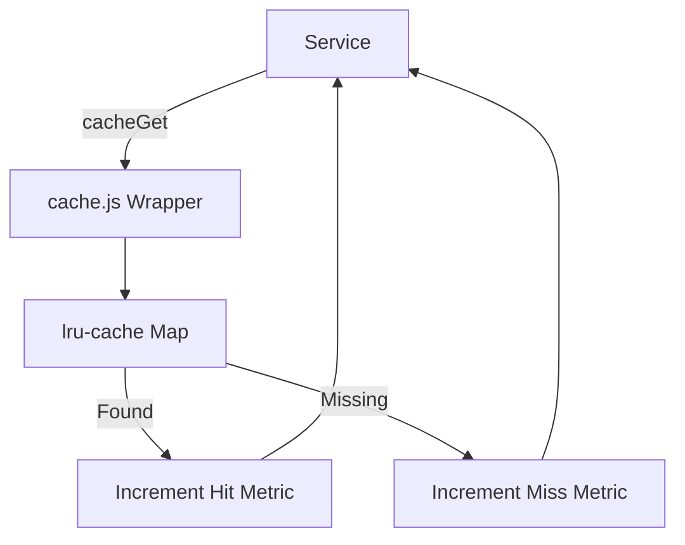

# File Documentation

File:
`src/infrastructure/cache.js`

Domain:
Infrastructure / Caching

Layer:
Data Access Layer (Infrastructure)

Runtime Role:
Provides a unified, high-performance in-memory caching interface with automatic metric tracking.

Dependencies:

- `lru-cache`
- `src/infrastructure/metrics.js`

---

# 2. PURPOSE

This file establishes a standardized in-memory caching mechanism for the application.

Instead of having different services instantiate their own caching logic, this file wraps `lru-cache` to enforce consistent memory limits, default Time-To-Live (TTL) behaviors, and, crucially, to intercept cache operations for observability (cache hits vs misses).

It is designed for high-frequency read scenarios (e.g., RBAC policies, rate limiting, rapid lookup tables) where querying PostgreSQL or even a remote Redis instance would introduce unacceptable latency.

---

# 3. RUNTIME RESPONSIBILITIES

Runtime Responsibilities:

- Instantiates an LRU (Least Recently Used) cache capped at 1000 items.
- Automatically evicts items older than 5 minutes (by default).
- Intercepts `get` requests to increment Prometheus-style telemetry counters (`hits` and `misses`).
- Exposes primitive cache operations: Get, Set, Delete, and Increment.

---

# 4. IMPORT ANALYSIS

## Important Imports

### `LRUCache` from `lru-cache`

Used for:

- Memory-safe key-value storage.
  Coupling Level: HIGH (The entire abstraction wraps this library).

### `metrics` from `./metrics.js`

Used for:

- Exporting operational health data (hit ratios).
  Runtime Position: Synchronous side-effect during `cacheGet`.

---

# 5. EXPORT ANALYSIS

## Exported Functions

### `cacheGet(key)`

Retrieves a value. Automatically updates telemetry metrics.

### `cacheSet(key, value, ttlSeconds)`

Stores a value. Overrides the default TTL if provided.

### `cacheDel(key)`

Invalidates a specific key.

### `cacheIncr(key)`

Atomically increments a numeric value, falling back to 0 if the value is missing or invalid. Used for local rate-limiting or rapid counters.

---

# 6. INTERNAL EXECUTION FLOW

## Execution Flow

1. On module load, the `memoryCache` singleton is created with strict bounds (max 1000 items).
2. During `cacheGet(key)`:
   - Queries `memoryCache`.
   - If value exists, increments `metrics.cache.hits` and returns it.
   - If missing, increments `metrics.cache.misses` and returns `null`.
3. During `cacheIncr(key)`:
   - Fetches current value.
   - Normalizes to a number.
   - Increments and saves with a 1-year TTL (effectively persisting until memory eviction).
   - Returns the new integer.



---

# 7. IMPORTANT CODE EXAMPLES

## Metric Interception

```javascript
const cacheGet = async (key) => {
  const val = memoryCache.get(key);
  if (val !== undefined && val !== null) {
    metrics.cache.hits += 1;
    return val;
  }
  metrics.cache.misses += 1;
  return null;
};
```

**Why this matters:**
In enterprise architectures, caching blindly without observing hit ratios is dangerous. If the hit ratio drops below 50%, the cache is likely misconfigured (TTL too low, max size too small) and the application is paying the penalty of cache management without the performance benefits.

---

# 8. CROSS-FILE RELATIONSHIPS

### `src/infrastructure/metrics.js`

Responsibility: Telemetry collection.
Relationship: `cache.js` tightly couples to the global `metrics` object to report its operational efficiency.

---

# 9. DATABASE INTERACTIONS

None directly. This file exists specifically to _prevent_ database interactions.

---

# 10. AUTHORIZATION & SECURITY

Security Risk:
Because this is a shared memory space across the Node.js process:

1. Cache keys MUST be heavily prefixed (e.g., `user:123:roles`) to prevent tenant data bleed.
2. Values stored are mutable objects by default in JavaScript. If a service fetches a cached user object and mutates it, it mutates the cached version for all subsequent requests.

---

# 11. VALIDATION FLOW

None.

---

# 12. LOGGING & OBSERVABILITY

- Telemetry integration is first-class via `metrics.cache.hits` and `metrics.cache.misses`.

---

# 13. ARCHITECTURAL RISKS

### Single Node State

This cache is memory-bound to the specific Node.js process. In a distributed deployment (e.g., 5 Kubernetes pods), cache invalidation (`cacheDel`) on Pod A will **not** invalidate the data on Pod B.

This makes it unsuitable for strongly consistent data (like changing a user's password and expecting immediate logout across all pods) unless paired with a Redis pub/sub invalidation broadcast.

### Mutation Vulnerability

`lru-cache` returns references to objects, not deep clones. Accidental mutations by a downstream service will corrupt the cache.

---

# 14. EXTENSION POINTS

- **Redis Adapter**: The API (`cacheGet`, `cacheSet`) is Promise-based despite wrapping a synchronous memory map. This is highly forward-looking. Future engineers can swap `lru-cache` for `ioredis` seamlessly without breaking consuming services.

---

# 15. ERP BUSINESS IMPACT

This file participates in:

- System Performance: Offloads high-frequency authorization or configuration reads from the primary database, lowering compute costs and reducing tail latency.

---

# 16. FINAL ENGINEERING ASSESSMENT

Maintainability:
HIGH

Coupling:
LOW (Hides `lru-cache` implementation details behind a generic API).

Scalability:
LOW for distributed state (Process-bound).
HIGH for throughput (In-memory lookup).

Primary Concern:
The lack of distributed invalidation means this should strictly be used for short-lived, eventually consistent data.
