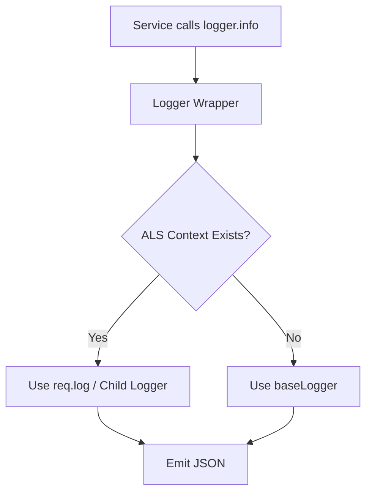

# File Documentation

File:
`src/infrastructure/logger.js`

Domain:
Infrastructure / Observability

Layer:
Process Utilities

Runtime Role:
Provides high-performance structured logging, automatic context correlation (Request IDs), and aggressive sensitive data redaction.

Dependencies:

- `pino`
- `config.js`
- `als.js` (AsyncLocalStorage)

---

# 2. PURPOSE

Logging in a high-throughput ERP system must be structured (JSON) so log aggregators (like ELK or Datadog) can parse it. Furthermore, it must be contextual; a single log line deep within a repository is useless unless it can be tied back to the HTTP request that triggered it.

This file provides a smart Proxy logger. It uses `Pino` for raw JSON logging speed, but intercepts every log call to dynamically inject the current Request ID utilizing the `AsyncLocalStorage` singleton.

---

# 3. RUNTIME RESPONSIBILITIES

Runtime Responsibilities:

- Configures the base Pino instance with environment-specific log levels (e.g., `silent` in tests, `debug` in dev, `info` in prod).
- Enforces strict security by automatically redacting passwords, tokens, and authorization headers from log outputs.
- Standardizes log payload formats (e.g., transforming `responseTime` into `durationMs`).
- Exports a Proxy object (`logger`) that checks `als` for a request-scoped child logger before falling back to the base logger.

---

# 4. IMPORT ANALYSIS

## Important Imports

### `pino`

Used for:

- Low-overhead JSON logging.
  Coupling Level: HIGH (The core of the logging strategy).

### `als.js`

Used for:

- Retrieving the active HTTP request context (correlation ID).
  Coupling Level: HIGH (Required for distributed tracing).

---

# 5. EXPORT ANALYSIS

## Exported Variables

### `export { logger }`

The primary logging interface used globally across the application.

Called by:

- Virtually every file in the system (services, controllers, bootstrap scripts).

---

# 6. INTERNAL EXECUTION FLOW

## Execution Flow

1. Reads environment config to determine `logLevel`.
2. Instantiates `baseLogger` with `pino()`, configuring formatters, timestamp formatting (`isoTime`), and redaction paths.
3. Constructs a `logger` wrapper object.
4. When `logger.info("message")` is called:
   - The wrapper asks `asyncLocalStorage.getStore()`.
   - If a store exists and has a `.logger` property (meaning this code is running inside an active HTTP request pipeline), it forwards the call to the request's child logger (which inherently contains `reqId`).
   - If the store is empty (meaning this is a boot script or background cron job), it forwards the call to `baseLogger`.



---

# 7. IMPORTANT CODE EXAMPLES

## Contextual Logger Proxy

```javascript
const logger = {
  info: (...args) => (asyncLocalStorage.getStore()?.logger || baseLogger).info(...args),
  error: (...args) => (asyncLocalStorage.getStore()?.logger || baseLogger).error(...args),
  warn: (...args) => (asyncLocalStorage.getStore()?.logger || baseLogger).warn(...args),
  // ...
};
```

**Why this matters:**
This is the magic of the Observability layer. Developers do not need to pass `req` or `logger` objects through service layers. They simply import this `logger` and use it. If they are in a request, the log automatically gets stamped with `{"reqId": "123-abc"}`.

## Aggressive Redaction

```javascript
redact: {
  paths: [
    'req.headers.authorization',
    'req.headers.cookie',
    'body.password',
    'body.token',
    'user.password',
    '*.password',
  ],
  censor: '[REDACTED]',
},
```

**Why this matters:**
Prevents compliance violations (GDPR/SOC2). If a developer accidentally logs an entire HTTP request object or user database record, Pino will intercept the paths and scrub sensitive fields in memory before writing to stdout.

---

# 8. CROSS-FILE RELATIONSHIPS

### `src/middleware/pino-http.middleware.js`

Responsibility: HTTP Request Logging.
Relationship: The middleware creates the child logger that the `als` store holds, which this file eventually pulls out at runtime.

---

# 9. DATABASE INTERACTIONS

None.

---

# 10. AUTHORIZATION & SECURITY

Security Boundary:
This file is the primary defense against Log Injection and Secret Leakage. The `redact` array is critical for maintaining infrastructure security.

---

# 11. VALIDATION FLOW

None.

---

# 12. LOGGING & OBSERVABILITY

This is the core implementation file for Observability.

---

# 13. ARCHITECTURAL RISKS

### Proxy Overhead

Evaluating `asyncLocalStorage.getStore()` on _every single log line_ introduces a tiny amount of V8 overhead. While negligible for most APIs, extremely tight loop iterations generating thousands of logs per second might show minor CPU spikes.

### Dynamic Child Loggers

The `.child(bindings)` proxy implementation returns a dynamic function wrapper. If heavily abused, it could create memory churn.

---

# 14. EXTENSION POINTS

- **New Redaction Targets**: Any new sensitive fields (e.g., `ssn`, `creditCardNumber`) added to the database MUST be added to the `redact.paths` array here.
- **Log Transport**: Currently writes to `stdout` (12-factor app compliant). If pushing directly to a service like Datadog is required, a Pino transport can be attached here.

---

# 15. ERP BUSINESS IMPACT

This file participates in:

- Security Compliance: Ensures logs are safe to ingest into SIEM platforms without leaking PII or secrets.
- Incident Response: Ensures developers can follow execution traces during production outages.

---

# 16. FINAL ENGINEERING ASSESSMENT

Maintainability:
HIGH

Coupling:
LOW (Services couple to its API, not its Pino implementation).

Scalability:
HIGH (Pino is one of the fastest Node.js loggers available).

Primary Concern:
None. The ALS-based proxy is an elegant solution to the context drilling problem.
