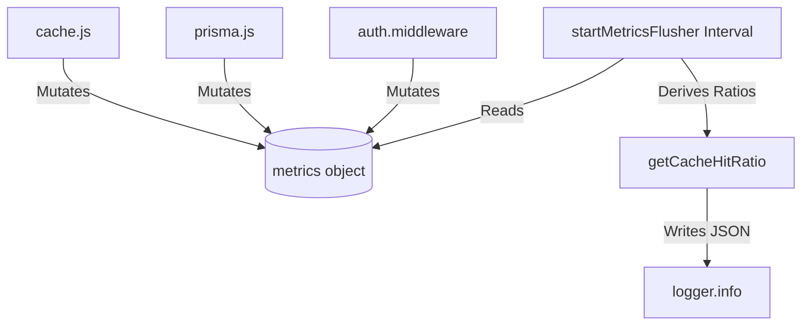

# File Documentation

File:
`src/infrastructure/metrics.js`

Domain:
Infrastructure / Observability

Layer:
Process Utilities

Runtime Role:
In-memory metric accumulator and periodic flushing service for application telemetry.

Dependencies:

- `logger.js`

---

# 2. PURPOSE

While request logs provide detailed granular execution traces, high-level operational health is better understood through aggregate metrics (counters and gauges).

This file acts as a lightweight, in-memory Prometheus-style metrics registry. It tracks cross-cutting concerns (cache hit ratios, slow queries, worker throughput) and periodically flushes summaries to the structured logger so that APM tools (Datadog/Splunk) can parse the JSON and build dashboards.

---

# 3. RUNTIME RESPONSIBILITIES

Runtime Responsibilities:

- Exports a mutable `metrics` singleton holding counters for various subsystems.
- Provides derived calculation functions (e.g., hit ratio, average duration).
- Exposes a `startMetricsFlusher` function that uses a non-blocking `setInterval` to periodically dump the current metrics state to `stdout` as a structured JSON log.

---

# 4. IMPORT ANALYSIS

## Important Imports

### `logger.js`

Used for:

- Flushing the telemetry summary to the log stream.
  Coupling Level: HIGH (The only output mechanism).

---

# 5. EXPORT ANALYSIS

## Exported Variables

### `export const metrics`

The globally shared mutable dictionary of telemetry counters.

Called by:

- `cache.js` (increments cache hits/misses).
- `prisma.js` (increments slow queries).
- `authorization.service.js` (increments denied requests).
- Background workers (increments worker durations).

### `export const startMetricsFlusher`

The initialization function to start the background reporting loop.

Called by:

- `src/index.js` during server bootstrap.

---

# 6. INTERNAL EXECUTION FLOW

## Execution Flow

1. The `metrics` object is initialized in memory with 0 values.
2. Various modules across the app import `metrics` and mutate its counters synchronously (e.g., `metrics.cache.hits++`).
3. During application boot, `startMetricsFlusher()` is called.
4. A `setInterval` is created (default 60 seconds). It is immediately `.unref()`'d so it does not prevent the Node.js process from exiting during a graceful shutdown.
5. Every 60 seconds, the interval computes derived metrics (like `getCacheHitRatio()`) and calls `logger.info()`.



---

# 7. IMPORTANT CODE EXAMPLES

## The Unreferenced Interval

```javascript
export const startMetricsFlusher = (intervalMs = 60000) => {
  if (flushInterval) clearInterval(flushInterval);
  flushInterval = setInterval(() => {
    logger
      .info
      // ... payload
      ();
  }, intervalMs).unref(); // <--- CRITICAL
};
```

**Why this matters:**
In Node.js, an active `setInterval` keeps the event loop alive. If a developer forgets `.unref()`, calling `server.close()` during shutdown will not terminate the process because the event loop is still waiting on this timer. By unreferencing it, the timer runs in the background but yields to process exits.

## Derived Metrics

```javascript
const getCacheHitRatio = () => {
  const total = metrics.cache.hits + metrics.cache.misses;
  if (total === 0) return 0;
  return (metrics.cache.hits / total).toFixed(2);
};
```

**Why this matters:**
Raw counters (1500 hits, 500 misses) are difficult to alert on. A normalized ratio (0.75) allows DevOps to set simple alarms (e.g., "Alert if Cache Hit Ratio < 0.50").

---

# 8. CROSS-FILE RELATIONSHIPS

### `src/index.js`

Responsibility: Bootstrapping.
Relationship: Triggers the flusher when the app boots.

---

# 9. DATABASE INTERACTIONS

None directly, but it tracks database performance by aggregating `slowQueries` reported by `prisma.js`.

---

# 10. AUTHORIZATION & SECURITY

Tracks authorization failures (`authorizationDenied`). A sudden spike in this metric across the fleet is a strong indicator of a credential stuffing attack or a broken frontend client.

---

# 11. VALIDATION FLOW

None.

---

# 12. LOGGING & OBSERVABILITY

This is entirely dedicated to Observability.
Log signature: `{ "event": "system.metrics" }`

---

# 13. ARCHITECTURAL RISKS

### Infinite Accumulation

The counters (`hits`, `misses`) grow infinitely for the lifetime of the Node.js process. In JavaScript, `Number.MAX_SAFE_INTEGER` is 9,007,199,254,740,991. While unlikely to hit this limit between deployments, proper Prometheus libraries usually reset counters or use floating windows to prevent precision loss.

---

# 14. EXTENSION POINTS

- **Prometheus Export**: If the infrastructure moves to Prometheus, this file can be swapped out to use `prom-client` to expose a `/metrics` route instead of flushing to stdout.

---

# 15. ERP BUSINESS IMPACT

This file participates in:

- Infrastructure Cost Management: By tracking slow queries and cache hit ratios, engineers can preemptively scale databases or optimize indexes before the ERP grinds to a halt.

---

# 16. FINAL ENGINEERING ASSESSMENT

Maintainability:
HIGH

Coupling:
LOW (A simple shared object).

Scalability:
HIGH (Sync mutation in V8 is incredibly fast).

Primary Concern:
Metrics are process-bound. If there are 10 pods, the log aggregator must sum the metrics across all 10 pods to get the true system state.
