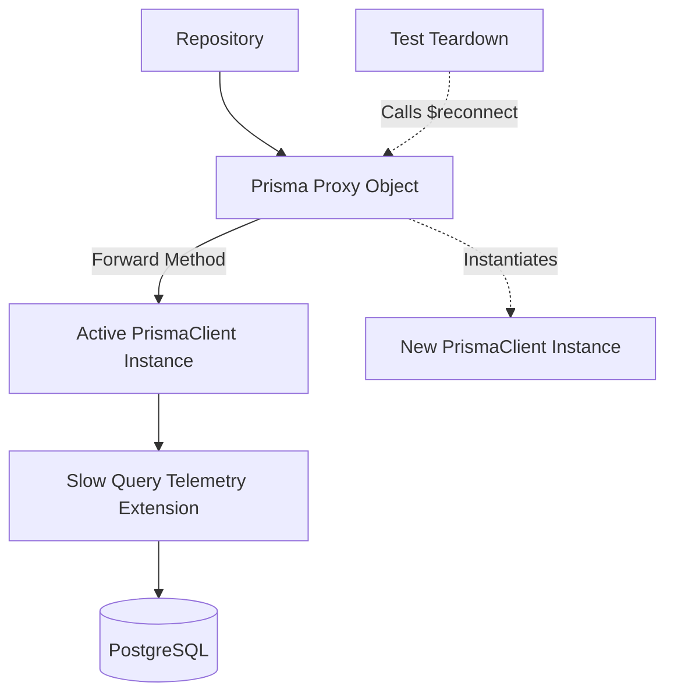

# File Documentation

File:
`src/infrastructure/prisma.js`

Domain:
Infrastructure / Persistence

Layer:
Data Access Layer

Runtime Role:
Instantiates the Prisma ORM client, configures global database extensions, and provides a proxy wrapper for integration testing.

Dependencies:

- `@prisma/client`
- `config.js`
- `metrics.js`
- `logger.js`

---

# 2. PURPOSE

This file is the single point of entry for all PostgreSQL interactions.

Rather than having services instantiate `new PrismaClient()` directly, this file centralizes the connection logic. This allows the application to globally enforce security policies (like omitting passwords), attach telemetry extensions (slow query tracking), and cleanly swap the database URL during integration tests using Testcontainers.

---

# 3. RUNTIME RESPONSIBILITIES

Runtime Responsibilities:

- Resolves the active database URL (favoring injected environment variables over static config to support dynamic Testcontainer ports).
- Enforces a global `omit` configuration to ensure `password` fields are never returned by any Prisma query across the entire app.
- Configures Prisma's internal logging engine.
- Binds an `$extends` middleware to track query execution time and report slow queries to the `metrics` singleton.
- Wraps the Prisma client in a JavaScript `Proxy` to allow the underlying connection to be hot-swapped during test teardowns without breaking ESM module bindings.
- Exposes a helper `runInTransaction` to standardize transaction boundaries.

---

# 4. IMPORT ANALYSIS

## Important Imports

### `@prisma/client`

Used for:

- The core ORM engine.
  Coupling Level: EXTREME. (The entire persistence layer relies on this).

### `metrics.js` & `logger.js`

Used for:

- Exporting telemetry regarding query performance.

---

# 5. EXPORT ANALYSIS

## Exported Variables

### `export { prisma, runInTransaction }`

`prisma` is the global Proxy object.
`runInTransaction` is a semantic wrapper around `prisma.$transaction`.

Called by:

- All repository files (`user.repository.js`, `note.repository.js`, etc.).

---

# 6. INTERNAL EXECUTION FLOW

## Execution Flow

1. On module load, `createClientInstance()` is invoked.
2. The URL is resolved.
3. The Prisma Client is initialized with `omitConfig` (excluding passwords).
4. In development mode, Prisma's internal query logs are intercepted and forwarded to the structured `pino` logger.
5. An extension is applied to all models (`$allModels`) and all operations (`$allOperations`). This extension starts a timer, executes the query, stops the timer, and checks against `config.prisma.slowQueryThresholdMs`.
6. The created client is saved to the internal `prismaClient` variable.
7. A `Proxy` is created and exported. Whenever a service calls `prisma.user.findUnique()`, the Proxy intercepts the call, binds the `this` context correctly, and forwards it to the active `prismaClient` instance.



---

# 7. IMPORTANT CODE EXAMPLES

## The High-Availability Proxy

```javascript
const prisma = new Proxy(
  {},
  {
    get(target, prop) {
      if (prop === '$reconnect') {
        return () => {
          logger.info('[Prisma Proxy] Evicting connection cache. Re-instantiating client for Testcontainers...');
          prismaClient = createClientInstance();
        };
      }
      const value = prismaClient[prop];
      if (typeof value === 'function') {
        return value.bind(prismaClient);
      }
      return value;
    },
  },
);
```

**Why this matters:**
ESM modules are singletons. If `user.repository.js` imports `prisma`, it holds a reference to that exact object. In integration tests using Testcontainers, the database container is destroyed and recreated on a _different_ port between test suites. Without this Proxy, the repository would hold a stale connection to a dead port. The `$reconnect` method allows the test runner to hot-swap the underlying connection while the repositories remain completely unaware.

## Global Password Omission

```javascript
const omitConfig = {
  user: {
    password: true,
  },
};
```

**Why this matters:**
This is a defense-in-depth security mechanism. Even if a developer writes `const users = await prisma.user.findMany()` and accidentally returns it directly in an API response, the password hash will be stripped at the ORM layer, preventing a catastrophic data leak.

---

# 8. CROSS-FILE RELATIONSHIPS

### `tests/setupTestDB.js` (Presumed)

Responsibility: Integration test orchestration.
Relationship: Calls `prisma.$reconnect()` between test suites to bind to the newly spawned Docker container.

---

# 9. DATABASE INTERACTIONS

Touched Models:

- ALL models.

Transaction Boundary:

- `runInTransaction` enforces explicit transaction boundaries, ensuring atomicity across multiple operations.

Query Patterns:

- Intercepts _all_ operations for telemetry.

---

# 10. AUTHORIZATION & SECURITY

Security Boundary:
The `omitConfig` guarantees password hashes never enter V8 user-space memory unless explicitly bypassed via raw queries.

---

# 11. VALIDATION FLOW

Prisma natively handles schema validation against the database structure.

---

# 12. LOGGING & OBSERVABILITY

- Logs raw SQL queries in development (with careful warnings about parameter leaks).
- Automatically detects and alerts on slow queries, feeding the data into `metrics.js`.

---

# 13. ARCHITECTURAL RISKS

### Proxy Performance Overhead

Wrapping the entire database interaction layer in a JavaScript `Proxy` introduces a very slight performance penalty on every property access. However, for most I/O bound applications, this is completely unnoticeable.

---

# 14. EXTENSION POINTS

- **Multi-Tenant Routing**: If the ERP moves to a database-per-tenant model, the Proxy could be modified to inspect `als.getStore().tenantId` and dynamically route the query to a tenant-specific Prisma Client instance.

---

# 15. ERP BUSINESS IMPACT

This file participates in:

- Data Integrity: Centralizes the execution point for all transactions.
- Security: Guarantees password redaction globally.

---

# 16. FINAL ENGINEERING ASSESSMENT

Maintainability:
HIGH

Coupling:
HIGH (The core data access layer).

Scalability:
HIGH (Handles connection pooling via Prisma engine).

Primary Concern:
None. The proxy pattern for Testcontainers is an advanced, highly effective solution.
