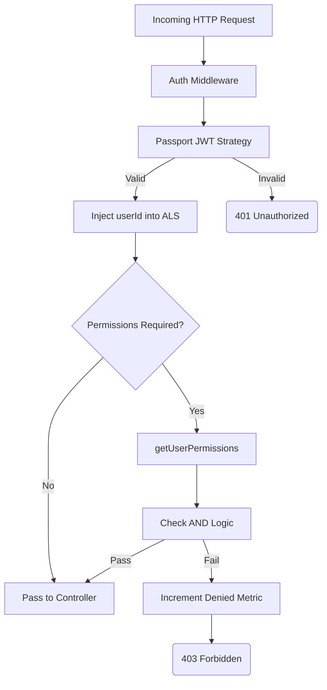

# File Documentation

File:
`src/middleware/auth.middleware.js`

Domain:
Cross-Cutting Concerns / Transport Middleware

Layer:
Transport / Security Layer

Runtime Role:
Express middleware factory that enforces JWT authentication and strict Role-Based Access Control (RBAC) authorization before allowing traffic into domain controllers.

Dependencies:

- `passport`
- `als.js` (Observability Context)
- `metrics.js` (Telemetry)
- `permission.service.js` (IAM Module)
- `ApiError.js`

---

# 2. PURPOSE

This file establishes the primary security gate for the entire ERP system.

It abstracts away the complexity of invoking Passport, extracting users, and checking database permissions. By providing a clean `auth('action:resource:scope')` factory, it allows developers to declare security requirements directly on the route definitions in a highly readable, self-documenting way.

It explicitly defers Attribute-Based Access Control (ABAC - e.g., "Is this _my_ note?") to the service layer, keeping this middleware purely focused on structural RBAC ("Are you allowed to read notes at all?").

---

# 3. RUNTIME RESPONSIBILITIES

Runtime Responsibilities:

- Wraps `passport.authenticate` inside an Express promise chain.
- If authentication fails, rejects the request with `401 Unauthorized`.
- Injects the authenticated `user.id` into the `AsyncLocalStorage` context (for logging and distributed tracing).
- If specific permissions were requested, it fetches the user's granted permissions via the IAM module.
- Evaluates the required permissions against the user's granted permissions using an strict `AND` logic (all required permissions must be met).
- Increments the `authorizationDenied` telemetry metric and throws `403 Forbidden` if requirements are not met.

---

# 4. IMPORT ANALYSIS

## Important Imports

### `permission.service.js`

Used for:

- Resolving the complex hierarchy of permissions assigned to the user's role.
  Coupling Level: HIGH. (This transport middleware relies heavily on the IAM domain).

### `als.js`

Used for:

- Propagating the `userId` to the logger without manually drilling it through function parameters.

---

# 5. EXPORT ANALYSIS

## Exported Functions

### `export { auth }`

The middleware factory used in Express routes.

### `export { verifyCallback }`

Exported primarily for unit testing the complex authorization logic in isolation from the Express request lifecycle.

---

# 6. INTERNAL EXECUTION FLOW

## Execution Flow

1. An HTTP request hits a protected route (e.g., `router.get('/', auth('read:users:any'), ...)`).
2. The `auth` middleware invokes Passport's JWT strategy.
3. Passport extracts the token, verifies it, and calls `verifyCallback`.
4. `verifyCallback` ensures the user exists.
5. The `userId` is pushed into the active logging context.
6. If `requiredPermissions` is empty, it calls `resolve()` immediately (auth-only).
7. If permissions are required, it calls `getUserPermissions(user.id)`.
8. It iterates through `requiredPermissions`, ensuring every single one is matched against the user's permission set.
9. If matched, `resolve()` is called. Next middleware executes.
10. If unmatched or errored, `reject(ApiError)` is called. The global error handler catches it.



---

# 7. IMPORTANT CODE EXAMPLES

## Context Injection

```javascript
// Inject userId into observability context for downstream tracing
const store = asyncLocalStorage.getStore();
if (store) {
  store.userId = user.id;
  if (store.logger) {
    store.logger = store.logger.child({ userId: user.id });
  }
}
```

**Why this matters:**
This is a critical observability pattern. By mutating the active logger child to include `userId: user.id`, every subsequent log emitted by the database, external API calls, or domain services during this request will automatically have the user's ID attached to it. This makes debugging multi-tenant issues trivial.

## Permission AND Logic

```javascript
// ALL required permissions must be satisfied (AND logic)
const hasAllRequired = requiredPermissions.every((perm) => matchesPermission(userPermissions, perm));
```

**Why this matters:**
This defines the security posture. If a route requires `['read:billing:any', 'write:billing:any']`, the user must have _both_. If OR logic is needed, it must be handled explicitly within the controller/service, as the perimeter defense defaults to the most restrictive check.

---

# 8. CROSS-FILE RELATIONSHIPS

### `src/modules/*/routes/*.route.js`

Responsibility: Route definitions.
Relationship: Imports `auth` to protect specific endpoints.

### `src/modules/iam/services/permission.service.js`

Responsibility: IAM Logic.
Relationship: Provides the logic that determines _how_ a permission string like `read:users:any` is evaluated against a role's grants.

---

# 9. DATABASE INTERACTIONS

None directly.
However, it invokes `getUserPermissions`, which will interact with the database (or cache) to resolve the roles.

---

# 10. AUTHORIZATION & SECURITY

Security Boundary:
This file IS the authorization perimeter.
It ensures that no unauthenticated or under-privileged traffic ever reaches the business controllers.

Potential Risk:
If `getUserPermissions` fails silently or resolves to an empty array due to a database glitch, the user is safely denied (fail-closed design).

---

# 11. VALIDATION FLOW

None.

---

# 12. LOGGING & OBSERVABILITY

- Interacts directly with `als.js` to augment the logging context.
- Updates `metrics.auth.authorizationDenied` on 403s.

---

# 13. ARCHITECTURAL RISKS

### Cache Miss Penalty

Because this middleware runs on _every protected route_, the underlying call to `getUserPermissions(user.id)` must be incredibly fast. If the IAM module does not cache user permissions aggressively, this file will cause massive database load (N+1 queries per request).

---

# 14. EXTENSION POINTS

- **Scope Expansion**: The permission format `action:resource:scope` could be expanded to support tenant checks (e.g., `action:resource:scope:tenant`).

---

# 15. ERP BUSINESS IMPACT

This file participates in:

- Access Control: Enforces the strict boundaries required in an ERP (e.g., ensuring standard employees cannot access the Payroll module).

---

# 16. FINAL ENGINEERING ASSESSMENT

Maintainability:
HIGH

Coupling:
MEDIUM (Coupled to IAM).

Scalability:
Depends entirely on the performance of the IAM module's permission resolution.

Primary Concern:
None, assuming the IAM permission service utilizes the `cache.js` layer effectively.
