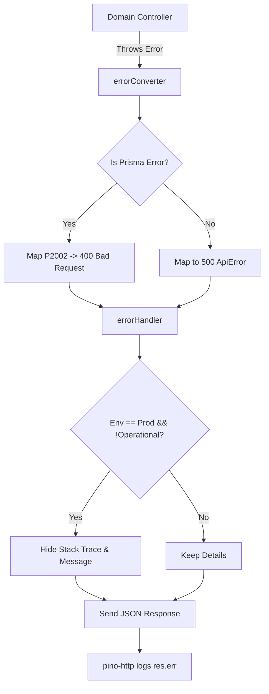

# File Documentation

File:
`src/middleware/error.middleware.js`

Domain:
Cross-Cutting Concerns / Error Handling

Layer:
Transport Middleware

Runtime Role:
Global error interceptor that converts unknown exceptions, specifically ORM (Prisma) errors, into standardized, predictable API responses.

Dependencies:

- `@prisma/client`
- `config.js`
- `ApiError.js`

---

# 2. PURPOSE

In a Node.js API, unhandled errors will crash the process, and inconsistently handled errors will confuse API consumers (e.g., sometimes returning HTML, sometimes raw stack traces, sometimes JSON).

This file provides the final safety net in the Express request pipeline. It guarantees that regardless of where or how an error occurs (validation, database constraint violation, or a random `TypeError`), the client always receives a strictly formatted `{ success: false, error: { ... } }` JSON response, without leaking sensitive stack traces in production.

---

# 3. RUNTIME RESPONSIBILITIES

Runtime Responsibilities:

- Catches errors that fall through the middleware chain.
- Analyzes the error prototype. If it is a native `PrismaClientKnownRequestError` or `PrismaClientValidationError`, it maps Prisma's proprietary error codes (like `P2002`) into standard HTTP status codes (like `400 Bad Request`).
- Wraps generic errors into the custom `ApiError` class.
- Strips stack traces and obscure error messages if the environment is `production` and the error is not marked as `isOperational`.
- Mutates `res.err` and `res.locals` so that the Pino HTTP logger has access to the exact failure state when it writes the final access log.
- Dispatches the final HTTP response to the client.

---

# 4. IMPORT ANALYSIS

## Important Imports

### `@prisma/client`

Used for:

- Checking `error instanceof Prisma.PrismaClientKnownRequestError` to parse database violations safely.
  Coupling Level: HIGH (Deeply coupled to the specific ORM).

### `ApiError.js`

Used for:

- Standardizing the internal error representation before serialization.

---

# 5. EXPORT ANALYSIS

## Exported Functions

### `export { errorConverter, errorHandler }`

`errorConverter` is executed first to normalize the error.
`errorHandler` is executed second to format and send the response.

Called by:

- `src/app.js` (mounted at the very bottom of the Express pipeline).

---

# 6. INTERNAL EXECUTION FLOW

## Execution Flow

1. An exception is thrown in a Controller or Service.
2. The `catchAsync` wrapper passes it to Express `next(err)`.
3. `errorConverter` intercepts it.
4. If it's already an `ApiError`, it passes it along.
5. If it's a Prisma error, it inspects the `.code` (e.g., `P2002` = Unique Constraint Failed) and constructs a new `ApiError` with a 400 or 404 status.
6. If it's a generic JS error (e.g., `ReferenceError`), it creates a 500 `ApiError`.
7. `errorConverter` calls `next(convertedError)`.
8. `errorHandler` receives it.
9. In production, if it is a 500 (non-operational), it overwrites the message with generic "Internal Server Error" to prevent leaking database schema or logic details.
10. It attaches the error to `res.err` for `pino-http` to log.
11. It sends the final JSON payload to the client.



---

# 7. IMPORTANT CODE EXAMPLES

## Prisma Error Translation

```javascript
if (error.code === 'P2002') {
  statusCode = httpStatus.BAD_REQUEST;
  message = 'Resource already exists';
  error.name = 'RESOURCE_ALREADY_EXISTS';
} else if (error.code === 'P2025') {
  statusCode = httpStatus.NOT_FOUND;
  message = 'Resource not found';
  error.name = 'RESOURCE_NOT_FOUND';
}
```

**Why this matters:**
Prisma throws massive, highly detailed error objects. If an API user tries to create a user with an email that already exists, Prisma throws a `P2002`. This converter ensures the API doesn't crash with a 500, but rather gracefully tells the client it made a `400 Bad Request` without exposing the underlying SQL or Prisma schema definitions.

## Production Leak Prevention

```javascript
if (config.env === 'production' && !err.isOperational) {
  statusCode = httpStatus.INTERNAL_SERVER_ERROR;
  message = httpStatus[httpStatus.INTERNAL_SERVER_ERROR];
}
```

**Why this matters:**
If a developer accidentally leaves `console.log(undefinedVar.foo)` in the code, the resulting `TypeError` might contain absolute file paths to the server's internal filesystem. This block guarantees that unpredicted errors return a safe, generic `500 Internal Server Error` string in production.

---

# 8. CROSS-FILE RELATIONSHIPS

### `src/app.js`

Responsibility: Application setup.
Relationship: Must place `errorConverter` and `errorHandler` strictly _after_ all routers.

### `src/middleware/pino-http.middleware.js`

Responsibility: Logging.
Relationship: Reads `res.err` which is populated by `errorHandler`.

---

# 9. DATABASE INTERACTIONS

None directly, but acts as the global safety net for all failed database interactions.

---

# 10. AUTHORIZATION & SECURITY

Security Boundary:
Prevents Information Disclosure vulnerabilities by scrubbing stack traces and unhandled exception messages in production.

---

# 11. VALIDATION FLOW

Catches and formats `PrismaClientValidationError` when the repository attempts to save a malformed payload.

---

# 12. LOGGING & OBSERVABILITY

Does not log directly. Instead, it mutates `res.err`, relying entirely on `pino-http` to handle the actual stdout write. This prevents duplicate logging (where the error handler logs it, and then the request logger logs it again).

---

# 13. ARCHITECTURAL RISKS

### Silent Errors

By relying on `pino-http` to log the error _after_ the response is sent, if `pino-http` crashes or drops the log, the 500 error will be sent to the user but completely lost from the server logs.

---

# 14. EXTENSION POINTS

- **New External Services**: If the application integrates with Stripe or AWS, their specific SDK error types (e.g., `StripeCardError`) should be mapped inside the `errorConverter` to ensure they return clean 400s instead of crashing as 500s.

---

# 15. ERP BUSINESS IMPACT

This file participates in:

- API Reliability: Ensures automated API clients interacting with the ERP receive parseable JSON even when catastrophic system failures occur.

---

# 16. FINAL ENGINEERING ASSESSMENT

Maintainability:
HIGH

Coupling:
HIGH (Coupled to Prisma error codes).

Scalability:
HIGH.

Primary Concern:
The Prisma error mappings are hardcoded. If Prisma changes their internal `P-` error codes in a major version upgrade, this file will need careful updating.
