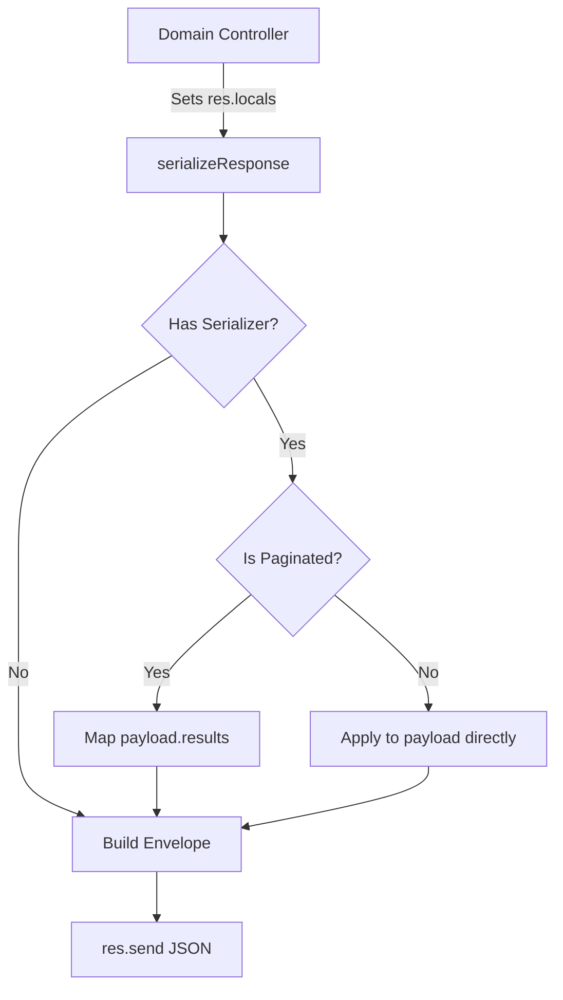

# File Documentation

File:
`src/middleware/response-interceptor.middleware.js`

Domain:
Cross-Cutting Concerns / Data Presentation

Layer:
Transport Middleware

Runtime Role:
Global interceptor that standardizes all successful API responses into a canonical envelope and automatically applies DTO serializers.

Dependencies:

- Express request lifecycle (`res.locals`)

---

# 2. PURPOSE

In large APIs, inconsistent response structures confuse frontend developers and mobile clients. For example, returning `{ user: ... }` from one route, `[...]` (an array) from another, and `{ data: ... }` from a third forces clients to write complex parsing logic.

This file establishes a **Canonical Response Envelope**. It guarantees that every successful API response takes the exact same shape: `{ success: true, data: ..., meta: ... }`. Furthermore, it decouples controllers from serializers; controllers simply dump raw domain objects into `res.locals`, and this middleware handles the transformation.

---

# 3. RUNTIME RESPONSIBILITIES

Runtime Responsibilities:

- Inspects `res.locals.payload` and `res.locals.statusCode`. If neither exists, it assumes the route was handled manually (e.g., health probes) and skips.
- Handles `204 No Content` gracefully.
- Inspects `res.locals.serializer`. If a serializer function was provided by the controller, it applies it to the payload.
- Automatically detects paginated payloads (arrays wrapped in pagination metadata) and applies the serializer strictly to the inner `results` array.
- Wraps the finalized data in the canonical envelope and terminates the HTTP request via `res.send()`.

---

# 4. IMPORT ANALYSIS

This file has no external imports. It relies purely on the Express `(req, res, next)` signature.

---

# 5. EXPORT ANALYSIS

## Exported Functions

### `export { serializeResponse }`

The middleware function.

Called by:

- `src/app.js` (Mounted globally _after_ the `v1Router` but _before_ the 404/Error handlers).

---

# 6. INTERNAL EXECUTION FLOW

## Execution Flow

1. Controller finishes its work. Instead of calling `res.send(user)`, it does:
   ```javascript
   res.locals.payload = user;
   res.locals.serializer = userSerializer;
   next(); // passes control to the interceptor
   ```
2. Interceptor catches the request.
3. If a serializer exists:
   - If payload is paginated (has `results` and `page`/`nextCursor`), it iterates over `results` and applies the serializer to each item.
   - If payload is a flat array, it maps over the array.
   - If payload is a single object, it applies the serializer directly.
4. It constructs the canonical response: `{ success: true, data: serializedData }`.
5. It triggers `res.status(statusCode).send(response)`.



---

# 7. IMPORTANT CODE EXAMPLES

## Pagination Detection

```javascript
if (
  payload &&
  payload.results &&
  Array.isArray(payload.results) &&
  (typeof payload.page !== 'undefined' || typeof payload.nextCursor !== 'undefined')
) {
  // It's a paginated response (offset or cursor), serialize the array explicitly
  data = {
    ...payload,
    results: payload.results.map((item) => serializer(item)),
  };
}
```

**Why this matters:**
Without this block, passing a paginated object to a serializer like `userSerializer` would strip out all the pagination metadata (because `page` and `limit` aren't properties on a User). This logic allows controllers to stay incredibly clean while still supporting complex cursor/offset pagination.

---

# 8. CROSS-FILE RELATIONSHIPS

### `src/app.js`

Responsibility: Application setup.
Relationship: Must place this middleware precisely after routing but before error handling.

### `src/shared/Paginate.js` & `PaginateCursor.js`

Responsibility: Database pagination.
Relationship: The interceptor explicitly looks for the signature of these pagination utilities to know how to serialize their internal arrays.

---

# 9. DATABASE INTERACTIONS

None.

---

# 10. AUTHORIZATION & SECURITY

Security Boundary:
This file executes the serializers. Serializers act as the final Data Loss Prevention (DLP) layer, stripping sensitive fields (like password hashes or internal IDs) before the JSON goes over the wire. This interceptor guarantees that the serializer is actually run.

---

# 11. VALIDATION FLOW

None.

---

# 12. LOGGING & OBSERVABILITY

None.

---

# 13. ARCHITECTURAL RISKS

### Strict Envelope Rigidity

Because this middleware forces the `{ success: true, data }` format, it becomes impossible for controllers to return raw arrays or plain strings. This is excellent for API consistency, but breaks compatibility if integrating with third-party webhooks that expect specific raw JSON structures. Such webhooks would need to bypass this middleware (e.g., mounted directly on `app.js`).

---

# 14. EXTENSION POINTS

- **Metadata Handling**: The `meta` key is currently appended if provided in `res.locals.meta`. This can be used to pass deprecation warnings or feature flags down to the client.

---

# 15. ERP BUSINESS IMPACT

This file participates in:

- API Consistency: Ensures frontend and mobile clients can build a single, reliable generic API wrapper instead of checking for varying response shapes.

---

# 16. FINAL ENGINEERING ASSESSMENT

Maintainability:
HIGH

Coupling:
LOW (Operates entirely on duck-typing the `res.locals` object).

Scalability:
HIGH.

Primary Concern:
None. The interceptor pattern is a highly scalable architectural choice for large Express monoliths.
