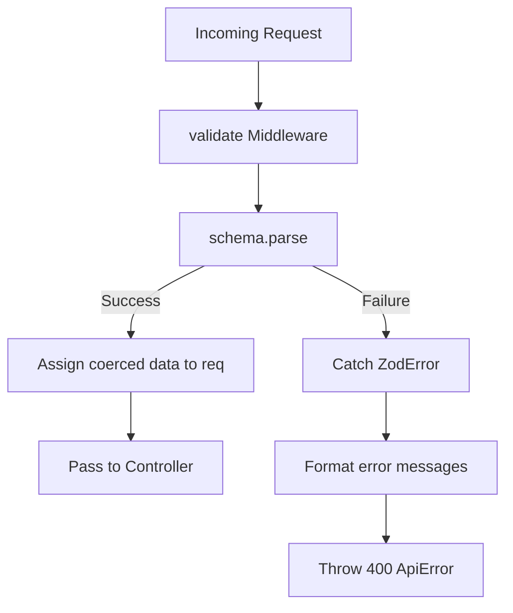

# File Documentation

File:
`src/middleware/validate.middleware.js`

Domain:
Cross-Cutting Concerns / Data Validation

Layer:
Transport Middleware

Runtime Role:
Express middleware factory that intercepts incoming HTTP requests and forces them through a strict Zod schema before allowing traffic to hit the controllers.

Dependencies:

- `zod`
- `http-status`
- `ApiError.js`

---

# 2. PURPOSE

If malicious, malformed, or unexpected data reaches the database or service layers, it causes unhandled exceptions or data corruption.

This file pushes validation to the absolute perimeter of the application. It guarantees that by the time a request reaches a controller, `req.body`, `req.query`, and `req.params` exactly match the defined types, structures, and business rules (like string lengths or regex patterns).

---

# 3. RUNTIME RESPONSIBILITIES

Runtime Responsibilities:

- Accepts a compiled Zod schema as a factory argument.
- Extracts `body`, `query`, and `params` from the Express request.
- Parses the combined payload synchronously against the schema.
- Re-assigns the validated data _back_ to the `req` object. This is critical because Zod performs type coercion (e.g., turning a query param string `"10"` into a number `10`) and strips unallowed fields.
- Intercepts `ZodError` exceptions, aggregates the specific field failures into a human-readable string, and throws a standard `400 Bad Request` `ApiError`.

---

# 4. IMPORT ANALYSIS

## Important Imports

### `zod`

Used for:

- The core validation engine and error type checking.
  Coupling Level: HIGH.

### `ApiError.js`

Used for:

- Standardizing the validation failure into the application's unified error format.

---

# 5. EXPORT ANALYSIS

## Exported Functions

### `export { validate }`

The middleware factory.

Called by:

- All route definitions across the application (e.g., `user.route.js`, `note.route.js`).

---

# 6. INTERNAL EXECUTION FLOW

## Execution Flow

1. A route is requested (e.g., `router.post('/', validate(createUserSchema), ...)`).
2. The middleware intercepts the request.
3. It constructs an object containing the three payload sources: `{ body, query, params }`.
4. It calls `schema.parse()`.
5. If valid:
   - Zod returns a new object with coerced types and stripped unknown fields.
   - `Object.assign(req, validated)` overwrites the Express request object with the safe data.
   - `next()` is called.
6. If invalid:
   - A `ZodError` is thrown.
   - The catch block intercepts it.
   - It iterates over `error.issues`, concatenating the error messages (e.g., `"body.email: Invalid email, body.password: Too short"`).
   - It passes a 400 `ApiError` to the next error handler.



---

# 7. IMPORTANT CODE EXAMPLES

## Coercion and Stripping

```javascript
// Update request with validated and coerced data
Object.assign(req, validated);
```

**Why this matters:**
This is the most important line in the file. In Express, everything in `req.query` is a string. If the controller expects pagination limits (`?limit=10`), the Zod schema will coerce `"10"` into the integer `10`. By overwriting `req`, the controller can safely assume `typeof req.query.limit === 'number'`. Furthermore, if the user sent `{ email: "test@a.com", role: "admin" }` but the schema only allows `email`, Zod strips `role`, preventing Mass Assignment attacks.

## Error Aggregation

```javascript
if (error instanceof ZodError || error.name === 'ZodError') {
  const issues = error.issues || error.errors || [];
  const errorMessage = issues.map((details) => details.message).join(', ');
  return next(new ApiError(httpStatus.BAD_REQUEST, errorMessage));
}
```

**Why this matters:**
Returns a flat, comma-separated string to the client. This is simple and effective, though highly complex forms might require a more structured JSON error format in the future.

---

# 8. CROSS-FILE RELATIONSHIPS

### `src/modules/*/validators/*.validator.js`

Responsibility: Schema definitions.
Relationship: These files define the actual Zod rules that are passed into this middleware.

---

# 9. DATABASE INTERACTIONS

None.

---

# 10. AUTHORIZATION & SECURITY

Security Boundary:
Protects against:

- Mass Assignment (overwriting `isAdmin` or `id`).
- SQL/NoSQL Injection (by strictly typing inputs).
- Prototype Pollution (Zod strips unmapped properties).

---

# 11. VALIDATION FLOW

This is the executor of the entire application validation flow.

---

# 12. LOGGING & OBSERVABILITY

Does not log directly. Failed validations are thrown to `error.middleware.js` which eventually reach `pino-http`.

---

# 13. ARCHITECTURAL RISKS

### Flat Error Structure

Concatenating errors into a single string (`"email is invalid, password is too short"`) makes it difficult for frontend applications to map specific errors back to specific form fields (e.g., highlighting the email box in red). For an enterprise ERP, returning the raw structured Zod error array in the 400 response is generally preferred.

---

# 14. EXTENSION POINTS

- **Structured Error Responses**: Modify the catch block to attach the raw `error.issues` array to the `ApiError` so the global error handler can send a structured `{ field: "email", error: "invalid" }` payload to the client.

---

# 15. ERP BUSINESS IMPACT

This file participates in:

- Data Integrity: Ensures no garbage data ever enters the system.

---

# 16. FINAL ENGINEERING ASSESSMENT

Maintainability:
HIGH

Coupling:
LOW (Coupled to Zod API).

Scalability:
HIGH (Synchronous schema validation is very fast).

Primary Concern:
The flattened error message string will eventually cause friction for frontend developers building complex forms.
