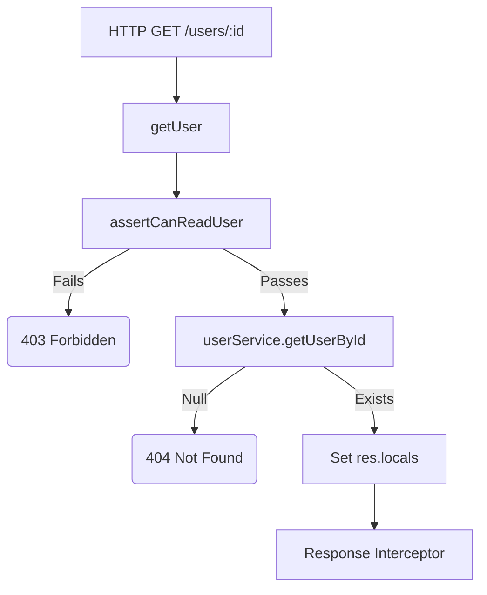

# File Documentation

File:
`src/modules/iam/controllers/user.controller.js`

Domain:
Identity and Access Management (IAM)

Layer:
Transport / Controller Layer

Runtime Role:
HTTP transport logic for User CRUD operations. Enforces Attribute-Based Access Control (ABAC) ownership checks.

Dependencies:

- `userService`
- `authorizationService`
- `serializeUser`
- `Pick` utility

---

# 2. PURPOSE

This controller manages standard administrative and self-service interactions with User entities.

Unlike the global RBAC middleware (`auth.middleware.js`) which determines if a request has the generic right to "read users," this controller enforces **ABAC (Attribute-Based Access Control)**. It ensures that a standard user can only read or update _their own_ profile, while an Admin can manage _any_ profile.

---

# 3. RUNTIME RESPONSIBILITIES

Runtime Responsibilities:

- Parses complex query parameters (filters, pagination, sorting) using the `pick` utility.
- Sanitizes incoming payloads (specifically stripping deprecated fields like `role` and logging a warning).
- Enforces ABAC via `authorizationService` before executing read/write operations.
- Delegates data access to `userService`.
- Prepares `res.locals` for the response interceptor, attaching the `serializeUser` function so the interceptor knows how to clean the returned entities.

---

# 4. IMPORT ANALYSIS

## Important Imports

### `authorizationService`

Used for:

- Performing contextual ownership checks (`assertCanReadUser`, `assertCanManageUser`).
  Coupling Level: HIGH. (Critical security dependency).

### `pick`

Used for:

- Safely extracting only specific keys from `req.query`, preventing NoSQL/SQL injection or unexpected filter criteria.

---

# 5. EXPORT ANALYSIS

## Exported Functions

### `createUser`, `getUsers`, `getUser`, `updateUser`, `deleteUser`

Called by:

- `src/modules/iam/routes/user.route.js`

---

# 6. INTERNAL EXECUTION FLOW

## Execution Flow: `getUser`

1. Router validates that the request has the generic `read:users:any` OR `read:users:own` permission.
2. The request reaches `getUser` controller.
3. Controller calls `authorizationService.assertCanReadUser(req.user, req.params.userId)`.
   - If the user is requesting their own ID, it passes.
   - If the user is requesting someone else's ID, but they don't have the `:any` scope, the service throws a `403 Forbidden`.
4. Controller calls `userService.getUserById(req.params.userId)`.
5. If the user doesn't exist, it throws a `404 Not Found`.
6. Sets `res.locals.payload` to the user object.
7. Sets `res.locals.serializer` to `serializeUser`.
8. Calls `next()` to invoke the response interceptor.



---

# 7. IMPORTANT CODE EXAMPLES

## ABAC Enforcement

```javascript
const updateUser = catchAsync(async (req, res, next) => {
  await authorizationService.assertCanManageUser(req.user, req.params.userId);

  const user = await userService.updateUserById(req.params.userId, req.body);
  // ...
});
```

**Why this matters:**
This separates perimeter security (RBAC) from data security (ABAC). The route definition says "You must be logged in to access this route." This specific line inside the controller says "Even though you are logged in, you can only update this specific database row if you own it, or if you are a super-admin." If you forget this line, you have introduced an Insecure Direct Object Reference (IDOR) vulnerability.

## Payload Sanitization

```javascript
if (req.body.role !== undefined) {
  logger.warn({ event: 'legacy.role_field.ignored', role: req.body.role }, 'Ignored deprecated role field in user payload');
  delete req.body.role;
}
```

**Why this matters:**
During migrations or refactors (e.g., moving from a simple `role` string to a complex permissions table), API clients often still send the old payloads. Instead of crashing or letting the field pass through to a repository that might reject it, this gracefully intercepts the deprecated field, ignores it, and generates a telemetry warning so developers know which clients still need to be updated.

---

# 8. CROSS-FILE RELATIONSHIPS

### `src/modules/iam/routes/user.route.js`

Responsibility: Routing and RBAC.
Relationship: The route maps HTTP methods to these controller functions.

### `src/middleware/response-interceptor.middleware.js`

Responsibility: Response Formatting.
Relationship: The controller passes the raw `user` object AND the `serializeUser` function reference to the interceptor, allowing the interceptor to apply the serialization safely.

---

# 9. DATABASE INTERACTIONS

None directly. Defers to `userService`.

---

# 10. AUTHORIZATION & SECURITY

Security Boundary:
This file is the primary defender against IDOR (Insecure Direct Object Reference) vulnerabilities for the User domain.

---

# 11. VALIDATION FLOW

Relies on `validate.middleware.js`. However, it adds a second layer of validation for query parameters using `pick` to ensure complex Prisma `where` objects cannot be injected via `req.query`.

---

# 12. LOGGING & OBSERVABILITY

Logs an explicit warning (`legacy.role_field.ignored`) if deprecated API fields are detected.

---

# 13. ARCHITECTURAL RISKS

### Boilerplate Fatigue

Every single read/write operation requires an explicit `assertCan...` call. If a developer forgets to add this line when creating a new controller method, it results in an immediate, critical security vulnerability.

---

# 14. EXTENSION POINTS

- **Bulk Operations**: If a `deleteManyUsers` endpoint is needed, a new controller function must be added, and it must loop through the targeted IDs to assert management permissions on _every single one_ before executing the bulk delete.

---

# 15. ERP BUSINESS IMPACT

This file participates in:

- Employee Directory / Profile Management: Handles how users view and edit their own profiles, and how HR/Admins manage the employee roster.

---

# 16. FINAL ENGINEERING ASSESSMENT

Maintainability:
HIGH

Coupling:
LOW

Scalability:
HIGH.

Primary Concern:
The manual ABAC assertions (`assertCanManageUser`) are prone to human error if a developer forgets to include them. Standardizing a pattern or decorator for this might be safer.
