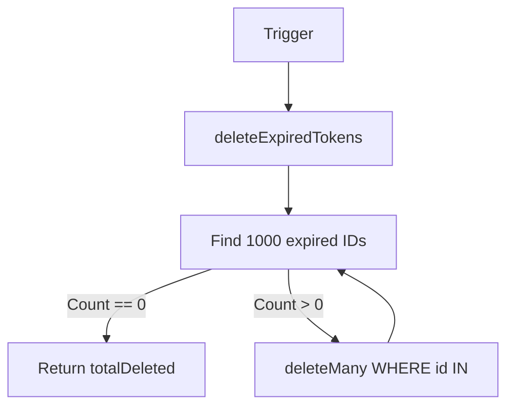

# File Documentation

File:
`src/modules/iam/repositories/token.repository.js`

Domain:
Identity and Access Management (IAM)

Layer:
Data Access / Repository Layer

Runtime Role:
Abstracts Prisma database operations for the `Token` entity.

Dependencies:

- `src/infrastructure/prisma.js`

---

# 2. PURPOSE

Repositories decouple the domain services from the specific ORM implementation.

If the project migrates from Prisma to Drizzle, or from Postgres to MongoDB, the `auth.service.js` and `token.service.js` files remain entirely unchanged. Only this file needs to be rewritten. It exposes clean, predictable data access methods that optionally accept a transaction client (`tx`).

---

# 3. RUNTIME RESPONSIBILITIES

Runtime Responsibilities:

- Creates Token records, explicitly connecting them to the correct `User` via Prisma relational syntax.
- Looks up single tokens by various filters (like `token` string or `type`).
- Deletes tokens by ID or by bulk filter (e.g., deleting a whole `familyId`).
- Implements `deleteExpiredTokens` which safely batches the deletion of millions of expired tokens to prevent locking the database table.

---

# 4. IMPORT ANALYSIS

## Important Imports

### `prisma`

Used for:

- Default connection client when a transaction (`tx`) is not provided.
  Coupling Level: HIGH (Intentionally coupled to the ORM).

---

# 5. EXPORT ANALYSIS

## Exported Functions

### `create`, `findOne`, `deleteById`, `deleteMany`, `updateById`, `deleteExpiredTokens`

Called by:

- `src/modules/iam/services/token.service.js`
- `src/modules/iam/services/auth.service.js`
- External cron jobs (for `deleteExpiredTokens`).

---

# 6. INTERNAL EXECUTION FLOW

## Execution Flow: `deleteExpiredTokens`

1. A cron job (or similar trigger) calls this function.
2. It sets a `BATCH_SIZE = 1000`.
3. It starts a `while (hasMore)` loop.
4. Queries the database for up to 1000 tokens where `expires < new Date()`.
5. If none are found, it breaks the loop.
6. If found, it extracts their IDs and executes a `deleteMany({ where: { id: { in: ids } } })`.
7. Accumulates the `totalDeleted` count.
8. Loops until the database is clean.



---

# 7. IMPORTANT CODE EXAMPLES

## Transactional Support

```javascript
const deleteMany = async (filter, tx = prisma) => {
  return tx.token.deleteMany({
    where: filter,
  });
};
```

**Why this matters:**
Every function in this repository accepts `tx = prisma`. If `auth.service.js` opens a transaction, it passes `tx` as the last argument. The repository executes the query on that specific transaction connection. If a service calls it directly without a transaction, it falls back to the global `prisma` singleton. This is a crucial pattern for maintaining ACID compliance across multi-table operations.

## Batched Deletion

```javascript
const expiredTokens = await tx.token.findMany({
  where: { expires: { lt: new Date() } },
  select: { id: true },
  take: BATCH_SIZE,
});
```

**Why this matters:**
If a system has 5 million expired tokens, running a raw `DELETE FROM tokens WHERE expires < NOW()` would lock the table for a significant amount of time, bringing down the ERP. The batched `findMany` followed by `deleteMany` limits the lock size to 1000 rows at a time, allowing normal application traffic to interleave safely.

---

# 8. CROSS-FILE RELATIONSHIPS

### `src/modules/iam/services/auth.service.js`

Responsibility: Domain orchestration.
Relationship: heavily relies on `deleteMany` to clear out reset tokens and token families during rotation and reuse detection.

---

# 9. DATABASE INTERACTIONS

Touched Models:

- `Token`

---

# 10. AUTHORIZATION & SECURITY

Security Boundary:
Does not enforce security natively (assumes the Service layer has already checked permissions and hashed the token string).

---

# 11. VALIDATION FLOW

None.

---

# 12. LOGGING & OBSERVABILITY

None. Repositories should generally not log, as it duplicates the Service layer's logging.

---

# 13. ARCHITECTURAL RISKS

### Lack of Pagination

`findOne` and `deleteMany` work fine, but if an admin dashboard needed to "view all active sessions for a user", a `findMany` or `paginateTokens` function would need to be added.

---

# 14. EXTENSION POINTS

- **Geographic Anomaly Detection**: By analyzing the `ip` and `userAgent` stored on these tokens, a future extension could detect if a user logs in from New York and then 5 minutes later from Beijing, automatically revoking the Beijing token.

---

# 15. ERP BUSINESS IMPACT

This file participates in:

- State Management: Manages the literal persistence of the authentication state.

---

# 16. FINAL ENGINEERING ASSESSMENT

Maintainability:
HIGH

Coupling:
LOW (Coupled only to Prisma).

Scalability:
HIGH (Specifically handles bulk deletes correctly).

Primary Concern:
None. Excellent repository pattern implementation.
