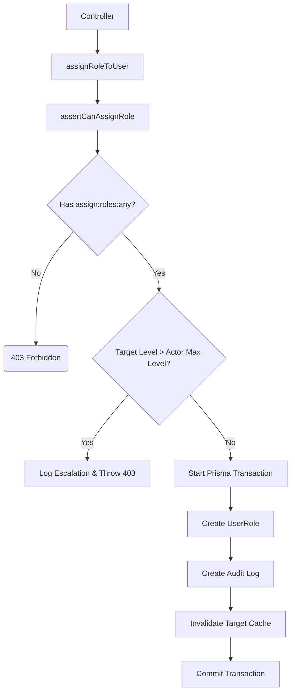

# File Documentation

File:
`src/modules/iam/services/authorization.service.js`

Domain:
Identity and Access Management (IAM)

Layer:
Domain Service Layer

Runtime Role:
Implements Attribute-Based Access Control (ABAC), Scope Resolution (`:own` vs `:any`), and Privilege Escalation Prevention.

Dependencies:

- `permission.service.js`
- `src/modules/audit/index.js`
- `src/infrastructure/prisma.js`

---

# 2. PURPOSE

While `auth.middleware.js` provides basic perimeter defense (RBAC), complex enterprise applications require contextual security (ABAC).

This file exists to answer the question: "Even though this user has the generic right to update users, do they have the right to update _this specific_ user?" It centralizes the resolution of ownership scopes and provides dedicated, heavily audited logic for highly sensitive operations (like assigning roles).

---

# 3. RUNTIME RESPONSIBILITIES

Runtime Responsibilities:

- Resolves contextual ownership scopes (`own` vs `any`).
- Evaluates scope against the user's cached permission tree.
- Emits high-severity `authz.escalation.attempted` logs if a user attempts to access resources outside their scope.
- Provides specific domain assertions (e.g., `assertCanReadUser`, `assertCanManageNote`).
- Implements strict Vertical Privilege Escalation prevention during role assignments.
- Coordinates database transactions when creating new `UserRole` mappings.

---

# 4. IMPORT ANALYSIS

## Important Imports

### `permission.service.js`

Used for:

- Querying the user's effective permissions (`hasPermission`) and maximum role hierarchy level (`getMaxRoleLevel`).
  Coupling Level: HIGH.

### `logEvent` from `../../audit/index.js`

Used for:

- Writing critical security infractions (escalations) directly to the immutable audit log.

---

# 5. EXPORT ANALYSIS

## Exported Functions

### `assertScopedPermission`

The core internal scope resolver.

### `assertCanReadUser`, `assertCanManageUser`, `assertCanManageNote`

Convenience wrappers used by domain controllers.

### `assertCanAssignRole`, `assignRoleToUser`

Role management orchestration.

Called by:

- `user.controller.js`
- Other domain controllers requiring ownership verification.

---

# 6. INTERNAL EXECUTION FLOW

## Execution Flow: `assignRoleToUser`

1. Receives the `actor` (the admin), `targetUserId`, and `roleId`.
2. Calls `assertCanAssignRole(actor, roleId)`.
3. Checks if `actor` has `assign:roles:any`. If not, throws 403.
4. Queries the database for the `actorMaxLevel` and the `targetRoleLevel`.
5. **Escalation Check**: If `targetRoleLevel > actorMaxLevel`, it immediately halts. This prevents a "Manager" from assigning someone the "SuperAdmin" role.
6. Emits a high-priority `authz.escalation.attempted` audit log and throws 403.
7. If passed, it opens a Prisma transaction.
8. Creates the `UserRole` record.
9. Creates an `authz.role.assigned` Audit Log.
10. Calls `invalidateUserPermissionCache(targetUserId)` so the target's new permissions take effect instantly on their next request.
11. Commits transaction.



---

# 7. IMPORTANT CODE EXAMPLES

## Scope Resolution

```javascript
const isOwnResource = actor.id === resourceOwnerId;
const requiredScope = isOwnResource ? 'own' : 'any';
const permission = `${action}:${resource}:${requiredScope}`;

if (await hasPermission(actor.id, permission)) {
  return true;
}
```

**Why this matters:**
This is the heart of the ABAC model. If a standard user tries to edit their own profile, `isOwnResource` is true, so it checks for `update:users:own` (which they likely have). If they try to edit a colleague's profile, it checks for `update:users:any` (which they don't have, but an Admin would). Because `permission.service.js` handles hierarchy, an Admin possessing `:any` automatically satisfies the `:own` check as well.

---

# 8. CROSS-FILE RELATIONSHIPS

### `src/modules/iam/controllers/user.controller.js`

Responsibility: Transport handler.
Relationship: The controller is completely dependent on these assertion functions to protect endpoints from IDOR.

---

# 9. DATABASE INTERACTIONS

Touched Models:

- `Role`
- `UserRole`
- `AuditLog`

Transaction Boundary:

- `assignRoleToUser` ensures that the mapping and the audit log are created atomically.

---

# 10. AUTHORIZATION & SECURITY

Security Boundary:
This file _is_ the internal Security Boundary. It mitigates IDOR (Insecure Direct Object Reference) and Vertical Privilege Escalation.

---

# 11. VALIDATION FLOW

None.

---

# 12. LOGGING & OBSERVABILITY

Highly observable. Emits distinct JSON logs for `authz.access.denied`, `authz.escalation.attempted`, and `authz.role.assigned`.

---

# 13. ARCHITECTURAL RISKS

### Cross-Domain Coupling

The `assertCanManageNote` function is currently located in the IAM module. Notes belong to the Notes module. This violates strict modular monolith boundaries.
_Note: The code contains a `// TODO:` comment acknowledging this technical debt and planning to move it to `src/modules/notes/policies/note.policy.js` in a future phase._

---

# 14. EXTENSION POINTS

- **New Domains**: As new modules are added (e.g., `Billing`, `Inventory`), new `assertCanManageX` functions (or separate policy files) must be created using the core `assertScopedPermission` engine.

---

# 15. ERP BUSINESS IMPACT

This file participates in:

- Security Governance: Ensures that hierarchy in the corporate structure (Role Levels) is mathematically enforced by the software, preventing lower-tier admins from staging a takeover of the ERP system.

---

# 16. FINAL ENGINEERING ASSESSMENT

Maintainability:
HIGH

Coupling:
MEDIUM (Couples IAM to other domains temporarily).

Scalability:
HIGH (Relies heavily on cache via `permission.service.js`).

Primary Concern:
Domain boundary leakage (`assertCanManageNote`). Needs to be refactored into a specific Policy layer as per the TODO.
