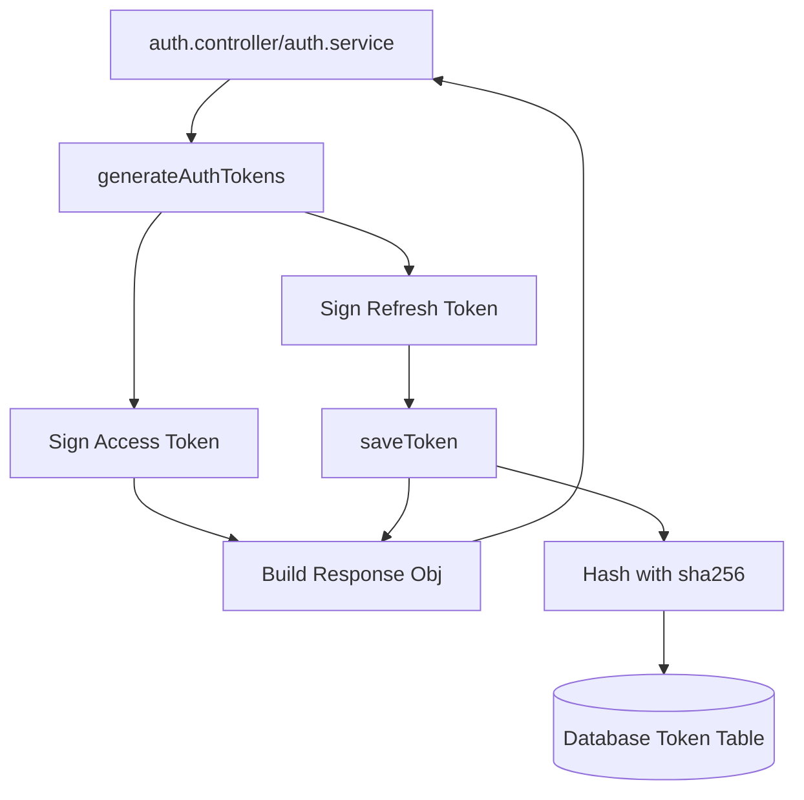

# File Documentation

File:
`src/modules/iam/services/token.service.js`

Domain:
Identity and Access Management (IAM)

Layer:
Domain Service Layer

Runtime Role:
Handles the cryptographic signing of JWTs, the secure hashing of tokens for database storage, and the validation of token payloads.

Dependencies:

- `jsonwebtoken`
- `dayjs` (Time manipulation)
- Node.js `crypto`
- `user.service.js`
- `token.repository.js`
- `src/infrastructure/config.js`

---

# 2. PURPOSE

Tokens represent the state and lifespan of a user's session.

This file separates the raw math of cryptography from the business orchestration in `auth.service.js`. It ensures that every token generated follows a strict standard (Subject, Issued At, Expiration, Type) and guarantees that tokens are hashed _before_ they are stored in the database, preventing database administrators from stealing active sessions.

---

# 3. RUNTIME RESPONSIBILITIES

Runtime Responsibilities:

- Uses `jsonwebtoken` to sign payloads using `config.jwt.secret`.
- Derives timestamps (`exp`, `iat`) securely using `dayjs`.
- Hashes raw JWT strings via `sha256` before writing them to the database.
- Generates grouped Access and Refresh token pairs.
- Orchestrates `familyId` creation, which is required by `auth.service.js` to detect Token Reuse across a single continuous session lifecycle.
- Reads `req.ip` and `req.userAgent` and stores them alongside the token for security auditing.

---

# 4. IMPORT ANALYSIS

## Important Imports

### `jsonwebtoken`

Used for:

- Core signing and verification logic.
  Coupling Level: HIGH.

### `crypto`

Used for:

- Hashing the tokens for persistence without salting (since JWTs are high-entropy).

---

# 5. EXPORT ANALYSIS

## Exported Functions

### `generateToken`, `saveToken`, `verifyToken`, `generateAuthTokens`, `generateResetPasswordToken`, `generateVerifyEmailToken`

Called by:

- `auth.service.js`
- `auth.controller.js`

---

# 6. INTERNAL EXECUTION FLOW

## Execution Flow: `generateAuthTokens`

1. Receives the `user`, optional `tx` (Prisma transaction), optional `familyId`, `ip`, and `userAgent`.
2. Calculates `accessTokenExpires` based on config (e.g., +15 minutes).
3. Calls `generateToken` for the Access Token (this token is _not_ saved to the DB because it is stateless).
4. Calculates `refreshTokenExpires` based on config (e.g., +30 days).
5. Calls `generateToken` for the Refresh Token.
6. Determines `tokenFamilyId` (uses the existing one if rotating, or generates a new `UUID` if it's a fresh login).
7. Calls `saveToken` for the Refresh Token.
8. `saveToken` immediately hashes the token string with `sha256` and writes it to the database with the associated metadata (`familyId`, `ip`, `userAgent`).
9. Returns the unhashed token strings and expiry dates to the caller.



---

# 7. IMPORTANT CODE EXAMPLES

## Secure Token Persistence

```javascript
const saveToken = async (...) => {
  return createTokenRecord(
    {
      token: hashToken(token), // Critical!
      userId,
      expires: expires.toDate(),
      type,
      blacklisted,
      familyId,
      ip,
      userAgent,
    },
    tx,
  );
};
```

**Why this matters:**
If an attacker compromises the database and reads the `tokens` table, they cannot hijack active user sessions because they only have the SHA-256 hash. The actual JWT required in the `Authorization: Bearer <token>` header is securely in the user's browser, and because SHA-256 is one-way, the attacker cannot reverse it.

## The Token Family ID

```javascript
const tokenFamilyId = familyId || crypto.randomUUID();
```

**Why this matters:**
Refresh tokens are single-use. When a user rotates a token, the new token belongs to the same _Family_. If the backend detects a blacklisted token being used (indicating it was stolen and both the attacker and victim are trying to rotate it), it queries the database for `familyId` and revokes _all_ tokens in that family, shutting out the attacker.

---

# 8. CROSS-FILE RELATIONSHIPS

### `src/modules/iam/services/auth.service.js`

Responsibility: Auth Logic.
Relationship: The primary consumer of this file. `auth.service.js` uses `verifyToken` extensively before allowing actions like password resets.

---

# 9. DATABASE INTERACTIONS

Touched Models:

- `Token`

Transaction Boundary:

- `saveToken` and `verifyToken` accept an optional `tx` argument, allowing them to participate in larger operations (like atomic password resets) orchestrated by `auth.service.js`.

---

# 10. AUTHORIZATION & SECURITY

Security Boundary:
This file executes cryptographic primitives. It is the absolute core of the session state.

---

# 11. VALIDATION FLOW

None.

---

# 12. LOGGING & OBSERVABILITY

Does not log directly. Relying on `auth.service.js` to emit the higher-level audit events.

---

# 13. ARCHITECTURAL RISKS

### Access Token Revocation

Because Access Tokens are stateless and not saved to the DB, they cannot be revoked. If an attacker steals an Access Token, they have guaranteed access until it expires (15 minutes). This is a standard tradeoff in JWT-based architectures, highlighting the need for short expiry times.

---

# 14. EXTENSION POINTS

- **Asymmetric Keys**: Currently uses symmetric HMAC signing (`config.jwt.secret`). For enterprise federations (like OAuth2 / OIDC providers), this should be upgraded to use RSA/ECDSA key pairs (RS256) so third-party microservices can verify the JWT using a public key without knowing the secret.

---

# 15. ERP BUSINESS IMPACT

This file participates in:

- Session Management: Determines exactly how long an employee stays logged in and ensures their session tokens cannot be spoofed.

---

# 16. FINAL ENGINEERING ASSESSMENT

Maintainability:
HIGH

Coupling:
LOW

Scalability:
HIGH.

Primary Concern:
None. Clean implementation of standard cryptographic patterns.
