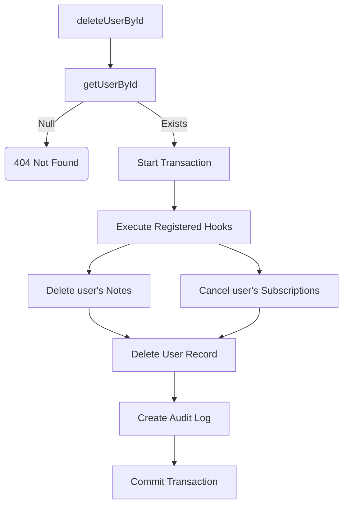

# File Documentation

File:
`src/modules/iam/services/user.service.js`

Domain:
Identity and Access Management (IAM)

Layer:
Domain Service Layer

Runtime Role:
Handles the business logic for creating, updating, querying, and explicitly orchestrating the tiered deletion of users.

Dependencies:

- `user.repository.js`
- `src/infrastructure/prisma.js`
- `src/shared/Password.js`
- `src/modules/audit/index.js`

---

# 2. PURPOSE

If controllers simply called the repository directly, the database would quickly fill up with unhashed passwords, duplicate emails, and orphaned relational data.

This file enforces the domain rules of a User entity:

- Passwords must be hashed before saving.
- Emails must be strictly unique.
- Deleting a user must execute side-effects across the system (e.g., deleting their Notes).
- Every state change (create, update, delete) must emit an Audit Log.

---

# 3. RUNTIME RESPONSIBILITIES

Runtime Responsibilities:

- Receives validated DTOs from `user.controller.js`.
- Hashes passwords using bcrypt.
- Performs async uniqueness checks on the `email` field.
- Dispatches write operations to `user.repository.js` inside Prisma transactions.
- Provides a **Dependency Inversion** mechanism (`userDeletionHooks`) allowing other domains to hook into the user deletion lifecycle without creating circular dependencies.
- Writes structured telemetry and audit logs.

---

# 4. IMPORT ANALYSIS

## Important Imports

### `user.repository.js`

Used for:

- Database I/O.
  Coupling Level: HIGH.

### `logEvent`

Used for:

- Pushing `users.created`, `users.updated`, and `users.deleted` events.

---

# 5. EXPORT ANALYSIS

## Exported Functions

### `createUser`, `queryUsers`, `getUserById`, `getUserByEmail`, `updateUserById`, `deleteUserById`

Standard CRUD orchestration.

### `registerUserDeletionHook`

Exported to allow external modules (like Notes) to register cleanup callbacks.

---

# 6. INTERNAL EXECUTION FLOW

## Execution Flow: `deleteUserById`

1. Looks up the user to ensure they exist. Throws 404 if not.
2. Opens a Prisma transaction `runInTransaction(async (tx) => ...)`.
3. Loops over `userDeletionHooks` (populated by other modules at boot time) and executes them via `Promise.all`.
   - Example: The Notes module has registered a hook that says `tx.note.deleteMany({ where: { ownerId: userId } })`.
   - This executes synchronously inside the active transaction.
4. If all hooks succeed, it calls `deleteUserByIdRecord` to delete the core user.
   - Note: Ephemeral IAM records like `Tokens` cascade automatically at the DB level.
5. Emits an audit log.
6. Commits the transaction.



---

# 7. IMPORTANT CODE EXAMPLES

## Dependency Inversion via Hooks

```javascript
const userDeletionHooks = [];
const registerUserDeletionHook = (hook) => userDeletionHooks.push(hook);

// Inside deleteUserById:
if (userDeletionHooks.length > 0) {
  await Promise.all(userDeletionHooks.map((hook) => hook(userId, tx)));
}
```

**Why this matters:**
This is a brilliant architectural pattern for a Modular Monolith. If `user.service.js` explicitly imported `note.service.deleteNotesByUser`, the IAM module would be tightly coupled to the Notes module. By exposing a registration array, the Notes module can import `registerUserDeletionHook` during system boot and attach its logic. IAM orchestrates the transaction but remains completely ignorant of what a "Note" is.

## Pre-Flight Async Validation

```javascript
if (updateBody.email && (await isEmailTaken(updateBody.email, userId))) {
  throw new ApiError(httpStatus.BAD_REQUEST, 'Email already taken');
}
```

**Why this matters:**
While the database has a `UNIQUE` constraint on the email column, relying on the DB to throw a `P2002` error is inefficient and causes messy log spam. Pre-flighting the check allows the service to return a clean, intentional 400 response.

---

# 8. CROSS-FILE RELATIONSHIPS

### `src/modules/notes/index.js` (Presumed)

Responsibility: Notes Module initialization.
Relationship: The Notes module uses `registerUserDeletionHook` at boot time to ensure data integrity.

---

# 9. DATABASE INTERACTIONS

Touched Models:

- `User`

Transaction Boundary:

- `createUser`, `updateUserById`, and `deleteUserById` all enforce strict transactions to ensure Audit Logs are written atomically with the data change.

---

# 10. AUTHORIZATION & SECURITY

Security Boundary:
Enforces password hashing. (The ABAC ownership assertions are handled strictly in the Controller).

---

# 11. VALIDATION FLOW

Executes async domain validation (`isEmailTaken`).

---

# 12. LOGGING & OBSERVABILITY

Rich audit logging for all mutations.

---

# 13. ARCHITECTURAL RISKS

### Hook Failure Cascade

If a registered hook (e.g., from an unstable third-party billing integration) throws an error during `deleteUserById`, the entire transaction rolls back. A bug in a tertiary module can prevent an admin from deleting a user. Hooks must be written carefully so they don't break core workflows.

---

# 14. EXTENSION POINTS

- **Soft Delete**: Enterprise systems rarely delete data permanently. This file should ideally be modified to execute a "Soft Delete" (updating `deletedAt = now()`) instead of a `delete` operation, preserving historical auditability.

---

# 15. ERP BUSINESS IMPACT

This file participates in:

- Employee Lifecycle Management: Handles the secure onboarding and offboarding (deletion) of staff.

---

# 16. FINAL ENGINEERING ASSESSMENT

Maintainability:
HIGH

Coupling:
LOW (Exceptional use of dependency inversion for cross-module side-effects).

Scalability:
HIGH.

Primary Concern:
None. The hook pattern inside a unified Prisma transaction is the gold standard for Modular Monoliths.
