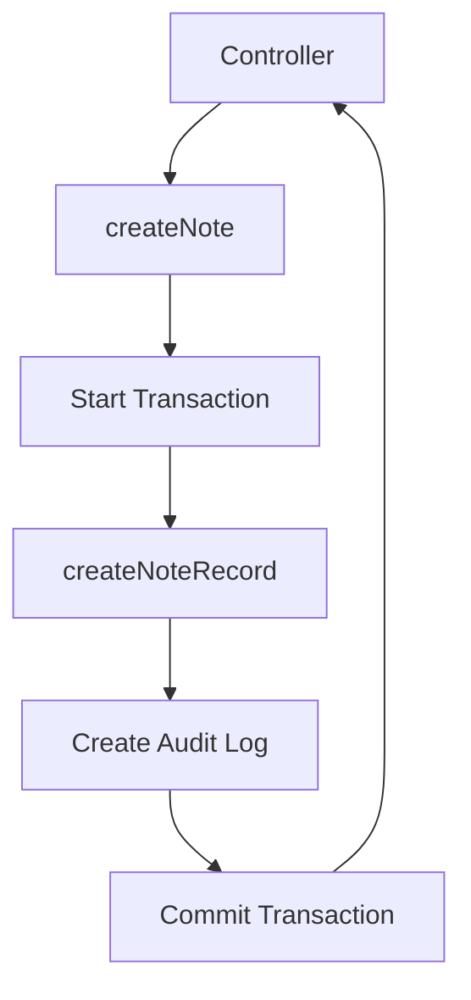

# File Documentation

File:
`src/modules/notes/note.service.js`

Domain:
Notes / Core Business Logic

Layer:
Domain Service Layer

Runtime Role:
Executes business logic for Note CRUD operations, guaranteeing atomic audit logging. Provides hooks for tiered deletion.

Dependencies:

- `note.repository.js`
- `src/infrastructure/prisma.js` (Transactions)
- `src/modules/audit/index.js`

---

# 2. PURPOSE

The service layer ensures that every time a note is created, updated, or deleted, the system remains internally consistent. It wraps database operations in transactions to guarantee that Audit Logs are written exactly alongside the data changes.

---

# 3. RUNTIME RESPONSIBILITIES

Runtime Responsibilities:

- Receives DTOs and `ownerId` from the controller.
- Dispatches write operations to `note.repository.js` inside Prisma transactions.
- Writes structured telemetry and immutable audit logs (`notes.created`, `notes.updated`, `notes.deleted`).
- Exposes `deleteManyByOwnerId` specifically to allow the IAM module to perform cascading deletions when a User is removed.

---

# 4. IMPORT ANALYSIS

## Important Imports

### `note.repository.js`

Used for:

- Database I/O.
  Coupling Level: HIGH.

### `logEvent`

Used for:

- Pushing state changes to the audit table.

---

# 5. EXPORT ANALYSIS

## Exported Functions

### `createNote`, `queryNotes`, `getNoteById`, `updateNoteById`, `deleteNoteById`

Standard CRUD orchestration.

### `deleteManyByOwnerId`

Used specifically for cross-domain lifecycle hooks (User deletion).

---

# 6. INTERNAL EXECUTION FLOW

## Execution Flow: `createNote`

1. Receives `noteBody` and `ownerId`.
2. Opens a Prisma transaction `runInTransaction(async (tx) => ...)`.
3. Calls `createNoteRecord` on the repository, spreading the body and explicitly setting the `ownerId`.
4. Emits a `notes.created` audit event inside the transaction.
5. Commits the transaction.
6. Returns the completed record to the controller.



---

# 7. IMPORTANT CODE EXAMPLES

## Cross-Domain Cascade Hook

```javascript
/**
 * Delete all notes for a specific owner
 * @param {string} ownerId
 * @param {Object} [tx] - Optional transaction client
 * @returns {Promise<Object>}
 */
const deleteManyByOwnerId = async (ownerId, tx) => {
  return deleteNotesByOwnerIdRecord(ownerId, tx);
};
```

**Why this matters:**
At the database layer, the foreign key from Note to User is set to `RESTRICT`. This means you cannot delete a User if they still have Notes. The `user.service.js` uses dependency inversion to call this function inside its own transaction. The `tx` argument here allows the Notes module to participate in the IAM module's transaction, deleting the notes safely before the user is deleted, preventing orphaned data.

---

# 8. CROSS-FILE RELATIONSHIPS

### `src/modules/notes/index.js` (Presumed)

Responsibility: Module initialization.
Relationship: The index file will likely register `deleteManyByOwnerId` with the `user.service.js` deletion hooks array.

---

# 9. DATABASE INTERACTIONS

Touched Models:

- `Note`

Transaction Boundary:

- `createNote`, `updateNoteById`, and `deleteNoteById` all enforce strict transactions to ensure Audit Logs are written atomically.

---

# 10. AUTHORIZATION & SECURITY

Security Boundary:
Does not enforce authorization directly (relies on the Controller to pass the correct `ownerId`).

---

# 11. VALIDATION FLOW

None.

---

# 12. LOGGING & OBSERVABILITY

Rich audit logging for all mutations.

---

# 13. ARCHITECTURAL RISKS

### Lack of Pagination Validation

The `queryNotes` function accepts arbitrary options. It relies heavily on the Controller and Validator layers to sanitize the limits and cursors.

---

# 14. EXTENSION POINTS

- **Rich Text / Attachments**: As the ERP grows, notes will likely need file attachments. This service would orchestrate the S3/GCS bucket uploads before creating the Note record.

---

# 15. ERP BUSINESS IMPACT

This file participates in:

- Data Integrity: Ensures that core business data is perfectly synchronized with the audit trail.

---

# 16. FINAL ENGINEERING ASSESSMENT

Maintainability:
HIGH

Coupling:
LOW

Scalability:
HIGH

Primary Concern:
None. The code perfectly implements the Transactional Outbox / Audit Log pattern.
