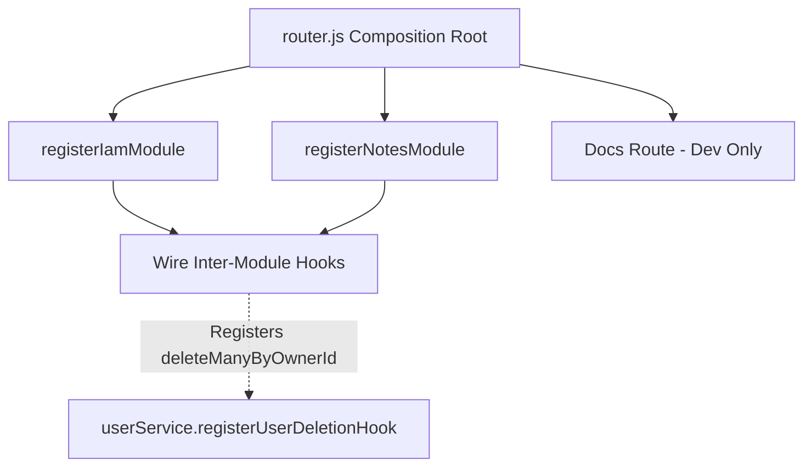

# File Documentation

File:
`src/modules/router.js`

Domain:
Cross-Module Orchestration

Layer:
Transport / Composition Root

Runtime Role:
Global route aggregation and inter-module event orchestration.

Dependencies:

- Express
- IAM Module (`registerIamModule`, `userService`)
- Notes Module (`registerNotesModule`, `deleteManyByOwnerId`)
- Global Configuration
- Rate Limiter Middleware
- Swagger Documentation Router

---

# 2. PURPOSE

This file serves as the **Composition Root** for the Express.js application's transport layer.

In a Modular Monolith architecture, modules must remain isolated and decoupled. This file exists to centralize the mounting of all module-specific routes onto a single global `v1Router`. It ensures that `app.js` does not need to import or know about individual business modules.

Furthermore, this file acts as the inter-module orchestration layer, wiring up cross-boundary events (like cascading deletions) without forcing the IAM module to import the Notes module directly.

---

# 3. RUNTIME RESPONSIBILITIES

Runtime Responsibilities:

- Instantiates the primary Express router for the `v1` API namespace.
- Injects infrastructure dependencies (like the `authLimiter`) into the IAM module during registration based on the environment.
- Registers the IAM module's routes.
- Registers the Notes module's routes.
- Wires up the `userDeletionHook` to ensure that when a user is deleted in the IAM module, all associated notes in the Notes module are also deleted transactionally.
- Conditionally mounts the Swagger OpenAPI documentation in development environments.

---

# 4. IMPORT ANALYSIS

## Important Imports

### `registerIamModule`, `userService` from `./iam/index.js`

Used for:

- Initializing identity and access management routes.
- Accessing the `userService` to register cross-module lifecycle hooks.
  Coupling Level: HIGH (Intentionally couples to module public APIs).

### `registerNotesModule`, `deleteManyByOwnerId` from `./notes/index.js`

Used for:

- Initializing the notes domain routes.
- Fetching the deletion logic to cascade user deletions.

### `config` & `rateLimiter`

Used for:

- Conditionally applying strict authentication rate-limiting in production environments.

---

# 5. EXPORT ANALYSIS

## Exported Functions

### `export { router as v1Router };`

The fully composed `v1` Express router containing all domain endpoints.

Called by:

- `src/app.js` (mounted onto `/v1`)

Depends on:

- All underlying module registrations completing successfully.

---

# 6. INTERNAL EXECUTION FLOW

## Execution Flow

1. A new Express router instance is created.
2. The IAM module is registered onto the router, with `authLimiter` injected if the environment is `production`.
3. The Notes module is registered onto the router.
4. The router wires cross-module hooks: It registers the `deleteManyByOwnerId` function from the Notes module into the `userService` of the IAM module.
5. If running in `development`, the `/docs` Swagger route is mounted.
6. The fully composed router is exported.



---

# 7. IMPORTANT CODE EXAMPLES

## Inter-Module Orchestration Example

```javascript
// INTER-MODULE ORCHESTRATION: Wire deletion cascading
if (typeof userService.registerUserDeletionHook === 'function' && typeof deleteManyByOwnerId === 'function') {
  userService.registerUserDeletionHook((userId, tx) => deleteManyByOwnerId(userId, tx));
}
```

**Why this matters:**
This is a textbook example of Modular Monolith decoupling. The IAM module (User Service) should not know that the "Notes" module exists, otherwise it creates a circular dependency. By registering the hook at the Composition Root (`router.js`), the IAM module can simply execute its registered hooks within its Prisma transaction, allowing the Notes module to delete its records without violating architectural boundaries.

## Module Registration Injection

```javascript
// COMPOSITION ROOT: MODULE REGISTRATION POINT
registerIamModule(router, {
  authLimiter: config.env === 'production' ? rateLimiter.authLimiter : undefined,
});
```

**Why this matters:**
Infrastructure concerns (like rate limiting) belong to the transport layer, not the business module. By injecting the `authLimiter` during registration, the IAM module remains pure and testable without spinning up Redis or complex rate-limiting infrastructure during unit tests.

---

# 8. CROSS-FILE RELATIONSHIPS

### `src/app.js`

Responsibility: Application setup.
Relationship: Imports `v1Router` and mounts it globally.

### `src/modules/iam/index.js`

Responsibility: IAM public API.
Relationship: `router.js` consumes its registration function and hooks to build the global router.

### `src/modules/notes/index.js`

Responsibility: Notes public API.
Relationship: `router.js` consumes its registration function and public services to orchestrate events.

---

# 9. DATABASE INTERACTIONS

Touched Models:

- None directly.

Transaction Boundary:

- `router.js` itself doesn't open transactions, but it explicitly passes the Prisma transaction (`tx`) across boundaries in the deletion hook: `(userId, tx) => deleteManyByOwnerId(userId, tx)`.

---

# 10. AUTHORIZATION & SECURITY

Security Boundary:

- Enforces strict rate-limiting on authentication routes in production environments.
- Protects documentation endpoints by ensuring they are only mounted in development.

---

# 11. VALIDATION FLOW

No DTO validation.

---

# 12. LOGGING & OBSERVABILITY

No explicit logging in this file.

---

# 13. ARCHITECTURAL RISKS

### Composition Root Bloat

As the application grows to 20+ modules, this file will become extremely large. All inter-module hooks and registrations will live here, potentially causing merge conflicts.

### Untyped Hook Contracts

The hooks (`typeof ... === 'function'`) rely on loose duck-typing in JavaScript. If `deleteManyByOwnerId` changes its signature, the compiler won't catch the mismatch, and cascading deletions will fail silently at runtime.

---

# 14. EXTENSION POINTS

- **Adding New Modules**: New modules MUST be registered here via a `registerXModule(router)` function.
- **New Inter-Module Events**: Any cross-module interactions (e.g., generating an Audit log when a Note is created) should be wired up here using a Publisher/Subscriber or Hook pattern to maintain module isolation.

---

# 15. ERP BUSINESS IMPACT

This file participates in:

- System Integration: Ensures different domains within the ERP (like Identity and Notes) can communicate and trigger cascading lifecycle events safely.

---

# 16. FINAL ENGINEERING ASSESSMENT

Maintainability:
MEDIUM (Risk of bloat as modules increase).

Coupling:
HIGH (By design, this is the Composition Root, it couples to everything).

Scalability:
HIGH (Standard Express routing).

Primary Concern:
The lack of strict typing on the inter-module hooks poses a risk for refactoring. Using an event emitter or a strongly typed internal message bus might be necessary as the system grows.
